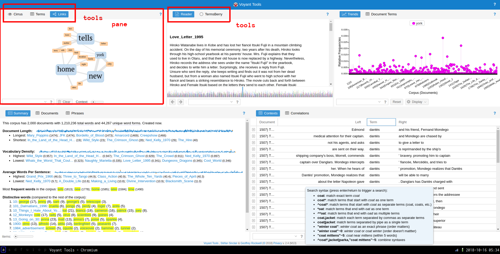

# Techniques and Tools: Practicum Notebooks

## Preflight info

## Preparatory notes

### Pre-requisites <a id="pre-requisites"></a>

Please download and install the following software in advance of the first class meeting:

* Sonic Visualiser [download](http://www.sonicvisualiser.org/download.html)
* MATCH Plugin for Sonic Visualiser [download](https://code.soundsoftware.ac.uk/projects/match-vamp/files) [installation instructions](https://www.vamp-plugins.org/download.html#install)
* Gephi [download](https://gephi.org/users/download/)
* AntConc [download](http://www.laurenceanthony.net/software/antconc/)
* OBS [download](https://obsproject.com/)
* Snes9x [download for Mac](http://www.s9x-w32.de/dl/snes9x-1.55-macosx-i386.zip) [download for Windows](http://www.s9x-w32.de/dl/snes9x-1.56.2-win32-x64.zip)
* Google Chrome
* Postman for Google Chrome [download](https://www.getpostman.com/)

Please also make sure that you know how to:

* create a folder
* create a `.zip` file \(“compressed folder”\) from this folder \([Mac OS X](https://www.digitaltrends.com/computing/how-to-make-a-zip-file-on-a-mac/) [Windows](https://support.microsoft.com/)\)

### Submitting your work <a id="submitting-your-work"></a>

For each _practicum_ session, you will be expected to submit a single `.zip` file containing all your work. Please create a folder for each session, and a folder for each exercise within that folder. Each exercise will specify precisely which files you will have to submit to be considered for full credit for that _practicum_. These files will be submitted via Courseworks, under the Assignments page.

> You should be able to finish the assigned tasks during the scheduled _practicum_ time. If you are finished early, feel free to leave the lab—or stick around and help your peers, if you are interested in learning how to be an effective peer leader. If you do not finish in time, you have until 11:59 p.m. on the day of the _practicum_ session to submit the completed work. You may not take advantage of this extension if you do not attend the entire lab: i.e. attendance at the lab session is compulsory.

### General advice <a id="general-advice"></a>

**Read the notebook in advance of the** _**practicum**_ **session**

In general, I assume no prior expertise with any of these tools, though I expect you to have basic computational literacy as an end user \(know how to install and run new programs, organize files on disk, use the Web, etc.\). If you are having trouble keeping up, please don’t hesistate to work through your questions at office hours. Some weeks may be more straightforward for you than others: that’s ok. Don’t be afraid to ask for help from me or from your peers during the _practicum_.

If you find yourself hoping to help your peers or to work through something together, the [four social rules described here are worth bearing in mind](https://www.recurse.com/social-rules). They are not binding, but have been shown to be particularly effective in instructional settings, where peer learning is encouraged. In brief:

* no “well, actually”
* try not to act surprised when someone doesn’t know something
* no backseat driving
* no subtle -isms \(sexism, racism, etc.\)

## 1. Sonic Visualiser I

### From analog to digital <a id="from-analog-to-digital"></a>

Music is sound and sound is vibrating air. The earliest recording technologies captured the motion of the air and mechanically transfer this motion to a recording surface: first, rotating wax and foil cylinders; eventually, vinyl records. The motion caused by the changing air pressure, traveling through a mechanical linkage, caused a stylus to move creating a groove of varying depth on the recording medium. The contours of this groove are the material trace of the recorded sound. To play back the sound, the flow of motion would essentially be reversed: the rotating disk causes the stylus to move, very slightly, retracing the grooves made during the recording process and causing a loudspeaker cone to vibrate analogously, setting the air in motion more or less as it was recorded, resulting in playback. In the words of Kittler:

> The phonograph permitted for the first time the recording of vibrations that human ears could not count, human eyes could not see, and writing hands could not catch up with. Edison’s simple metal needle, however, could keep up—simply because every sound, even the most complex or polyphonous, one played simultaneously by a hundred musicians, formed a single amplitude on the time axis.

Evidently, this is not how recordings are stored in digital media, among them: CD-ROMS, hard-drives, memory sticks, music players, and smartphones. From a digital perspective, the continuous and infinitely divisible motion of air—sound—must be described as a sequence of numbers, by periodically quantifying and recording the intensity of the motion. A digital audio file is essentially a wrapper around a recorded sequence of these observed intensities. The process of taking these observations is called **sampling**. When an audio signal is detected by a microphone, the motion of the air is first converted into voltage fluctuations, which vary continuously over time: as the air moves, so too does the voltage across the microphone. A piece of hardware called an analog-to-digital converter \(ADC\) measures these voltage fluctuations over time and converts them into a sequence of numbers, represented digitally \(i.e. as a set of discrete observations, almost always stored as a sequence of binary digits, or “bits”\).

At a fixed number of times per second—typically in the tens of thousands—the ADC takes a measurement of the voltage at that instant, usually relative to some predefined maximum. The **sample rate** is one parameter of the analog-to-digital conversion process that determines the fidelity of the digitally recorded sound compared to the original source. The diagram shows the effect of changing the sample rate on the “resolution” of the digital audio signal. You can think of this as analogous to resizing a digital image downwards with its concomitant loss of resolution.


A result known as the [Nyquist Sampling Theorem](http://mathworld.wolfram.com/NyquistFrequency.html) shows given the maximum frequency of a periodic component of a complex sound \(loosely, the highest “pitch” in a recording\), we can always pick a sample rate that is sufficiently high such that the original analog signal can be recovered perfectly from the digitized version, if the analog source was digitized at that sample rate. If these ideas are new to you, you might want to watch [this excellent introduction to digital media](https://xiph.org/video/vid1.shtml), though understanding the ins-and-outs of analog-to-digital audio conversion are not critical to completing this _practicum_ session.

### Sonic Visualiser <a id="sonic-visualiser"></a>

Sonic Visualiser \(SV\) is a toolkit for analyzing digital recordings and is very useful for the study of recorded music. Developed at Queen Mary University of London, it is freely available for a number of operating systems. Tools like this have been used in the study of [expressive timing](http://mtosmt.org/issues/mto.12.18.1/mto.12.18.1.ohriner.php), pitch, dynamics, and [vocal timbre \(Rings’s contribution\)](http://jams.ucpress.edu/content/68/3/653.article-info), as well as in [the forensic study of historical recordings](https://www.theguardian.com/music/musicblog/2007/feb/27/hattohoaxuncovered). We will learn how to use SV to examine the content of audio files, annotate the files at the beat level, and compare recordings.

SV is much like any audio editor, but it can load multiple files at once as well as offer a number of different visualizations of the audio data, which can be either overlaid or placed side-by-side. In addition to the relatively straightforward playback features that we would expect from an audio program, SV makes use of the following three key concepts:

* panes: A “slot” corresponding to a single audio file. A given SV session may make use of several panes.
* layers: A visualization that is derived from or tied to a pane. A given pane may have more than one layer. This allows us to superimpose audio visualizations and other data.
* transforms: Algorithmic manipulation of the audio file, including audio effects processing and automatic feature extraction \(e.g. beat detection or pitch tracking\)

When SV first launches, it will begin with a single pane, with three default layers. However, this pane does not yet contain an audio file. To load a file into the default pane, use `File > Open...`. Once the file is loaded, it should look something like this:


The three layers in use in this pane are addressable using the settings tabs on the right hand side of the interface, currently shown in the following order:

1. The first layer contains global settings for the pane
2. The second layer, `Ruler`, draws vertical lines at regular intervals to mark the passage of time. Note the range and the units of the x axis.
3. The third layer, `Waveform`, shows the amplitude of the audio signal over time: this is the blue mass visible in the pane. Note the range of the y axis. Is there a unit?

Switching between layers, you can make adjustments to how each layer appears. You can toggle the visibility of a layer using the `Show` check box on each layer’s settings tab. Unfortunately, reordering layers is not supported.

#### Waveform layer <a id="waveform-layer"></a>

The waveform layer shows the intensity of the sound wave as it evolves over time. Sudden, loud sounds will appear as peaks in the waveform. If you zoom in on the x-axis very close, you can almost see the individual samples. As we zoom out, we get something like the average intensity over time. Intensity is measured here in arbitrary units on a scale from -1 to +1.


> Q. There is something slightly misleading about this visualization of the sampled intensity values in SV. Based on your understanding of analog-to-digital conversion, what is it?

There are a couple of important settings to note in the `Waveform` layer tab:

* scale: Change the scale of the y axis, including a “Normalize to Visible Area” button
* channels: Describe how to treat data from stereo signals

#### Time instants layer <a id="time-instants-layer"></a>

Time instants layers contain instantaneous markers that can be used to “bookmark” certain events in the audio file. For example, time instants can be added to track the pulse of a musical excerpt, to demarcate the major formal sections of a song, or to highlight other interesting moments in an audio recording. Once you have added a time instants layer, and the layer is active in SV \(i.e. the corresponding tab is selected\), there are two main ways to create an instant:

1. During the playback of the audio file, hit the `Return` key
2. Alternatively, when the audio is not playing back, use the pen tool \(see the main toolbar\) to manually add an instant with your mouse

Once an instant has been added, it can be repositioned using the move tool \(also in the main toolbar\). This is useful, because tapping input will never be perfectly accurate for a number of reasons:

* limitations on human response rates to audio stimuli
* mis-hits or accidental double hits
* generally, operating systems do not provide strong real-time scheduling guarantees for keyboard press events: the latency between keypress and the actual recorded event can be up to 150ms in the worst case, which is inadequate for research purposes

To improve the accuracy of the placement of time instants, you can use the waveform or spectrogram layers as a visual guide to help you locate the onset of the musical event you are interested in tracking. You can use SV’s audio feedback feature, which plays a click or other user-defined sound at the moment of each time instant. To enable this for a time instant layer, make sure the desired layer is select, and click the loudspeaker icon at the bottom of the sidebar. Time instants have labels associated with them, which may be modified by hovering over the instant you wish to label with the navigate \(or, alternatively, move\) tool. The default label is fairly unhelpfully: “New Point”.


Multiple time instants layers may be overlapped in the same pane to provide annotations at different levels of detail. Here, bright blue time instants show the locations of beats in each measure that I added manually. The labels here indicate the measure number and the beat number \(e.g. `3.1` means measure 3, beat 1\). SV allows you to automatically label time instants sequentially according to a number of schemes, so that you don’t have to suffer the tedium of inputting the measure and beat numbers manually. This is done as follows:

1. Ensure that the desired time instants layer is selected
2. Choose from the set of supported ways of generating labels \(`Edit > Number New Instants with`\)
3. `Edit > Select All`
4. `Edit > Renumber Selected Instants`

A common error can reveal itself at this point. If the generated sequential numbering gets “off” in some way, it is usually due to the existence of two instants in the layer at or very near the same time point, effectively creating an undesired duplicate marker for the desired event. You can check for the existence of duplicate instants either by zooming in on the x axis or \(more robustly\) by revealing a tabular view of the layer data by clicking on `Layer > Edit Layer Data`. Be aware of this particular kind of dirty data not only in your own data but in also any datasets you might use in your own research that you did not collect yourself—it is more common than might would expect.


#### Time values layers <a id="time-values-layers"></a>

Time values are like time instants, in that they allow us to associate data with a specific timecode in the audio recording. Time values, however, associate real-valued numbers with each instant, which can be used to keep track of the evolution of certain measures made of the audio file over time, charting things like tempo, loudness, etc. Time values can be displayed as a line chart, as shown in the screenshot below. In this example, the time values record the tempo of the music in the recording as computed from the inter-onset interval \(i.e. the elapsed time between successive time instants in that layer\). To derive the time values from a time instants layer:

1. Create a time instants layer and fill it with the instants you are interested in deriving further data from
2. Create a new time values layer, which will be, at first, empty
3. Navigate to the time instants layer using the tabs in the left-hand sidebar
4. Use `Edit > Select All` \(or a keyboard shortcut\) to select all the time instants in the track
5. Navgiate to the newly created time values layer
6. Click `Edit > Paste`
7. A dialog box will pop up with a number of options from which you can choose the rule for assigning values to each instant in the new layer. Each old time instant will have one value associated with in the new layer.


#### Spectrogram layer <a id="spectrogram-layer"></a>

The spectrogram layer shows the results of a spectral analysis of the audio file. All complex sounds can be described as a combination of simpler components of different frequencies \(from high to low\). Spectral analysis takes an audio signal and splits it up into these components, using an analytic technique whose foundations date back to work done by [Jean-Baptiste Joseph Fourier](https://en.wikipedia.org/wiki/Joseph_Fourier) in 1822. A spectrogram visualizes the results of this analysis in a graphical plot. Time is represented on the x axis, as usual. Unlike the waveform view of the audio signal, the y axis now represents frequency \(pitch\). Furthermore, the spectrogram has one further visualization dimension: color. The color of the chart at a given x-y coordinate represents the power of that frequency’s contribution to the overall audio signal at that time point. Now, spectrograms are in widespread use and can be used by musicologists to study timbre and other low-level acoustical features of recorded music.

Spectrograms can also be used to examine the acoustic properties of simple sonic events. The figure shows two panes in SV, corresponding to a piano and violin playing the same notated pitch \(C4, or “middle C”\).


The color scheme in use here ranges from a dark-green \(representing the lowest value\) through yellow, with the highest values being represented in red. Middle C is approximately 261Hz, so we expect a band around this value to be prominent in the spectrogram. We call this the fundamental frequency. However, it’s apparent that there are other components in the spectrogram. These occur at integer multiples of the middle C frequency; they are called overtones. The overtone structure of a pitched sound is an important determinant of its timbre.

> Q. What timbral features that distinguish the violin and the piano to a regular listener can you recognize in the spectrogram?

Spectral analysis was also used extensively in the artificial synthesis of speech. The vocoder was developed by Dudley et al. at AT&T Bell Laboratories with the idea of reducing the bandwidth consumed on telephone line based on the principle of analyzing the speaker’s voice before transmission, sending a reduced-size representation of the voice down the wire, and resynthesizing the voice at the other end.


The vocoder team adapted the technologies developed for the vocoder project for use in a public demonstration of artificial speech synthesis in 1939, in a non-commercial tool called the Voder.


The schematic diagrams both emphasize the architectural similarity between the vocoder and the voder, and call attention to their principal difference: the interpolation of a manual human operator of the Voder, who controls the synthesized sound by means of a keyboard. In the vocoder, the human voice enters the system through a microphone and is decomposed into its frequency components by a bank of filters. The results of this decomposition are used in the “modulators” step, to selectively control the mixture resulting frequency components of the synthesized voice appropriate to the input sound. In the Voder, the operator silently uses a keyboard interface to control the mixture, according to their training in the spectral structure of speech phonemes.

#### Melodic range spectrogram layer <a id="melodic-range-spectrogram-layer"></a>

This is similar to the spectrogram, except that the range of the y axis is limited to correspond to the range of fundamentals that can be produced with the most common musical instruments \(and the human voice\). It is useful for musical transcription tasks in combination with the measurement tool.

#### Other tips <a id="other-tips"></a>

* Save your work regularly! SV is fairly stable, but it can still crash unexpectedly and sessions are not automatically saved \(as far as I know\)
* If you are preparing a spectrogram for publication, consider changing the color scheme—especially if your publication or submission requires greyscale images.

### Exercises <a id="exercises"></a>

First, refer to the [instructions of general applicability above]().

Extra instructions: Save your SV session file in the same directory as the original wave file for each exercise. At the end of the lab, zip the whole thing together into a single compressed folder/archive and upload to the Courseworks assignment associated with the practicum. Where audio files are linked in the instructions, you should use your browser to download the file in question.

#### E0. Download and install Sonic Visualiser <a id="e0-download-and-install-sonic-visualiser"></a>

#### E1. Pitch transcription <a id="e1-pitch-transcription"></a>

Download the linked file and open it in Sonic Visualiser. Use the measurement tool in connection with as melodic range spectrogram layer to estimate the names of the first sixteen pitches [in the linked recording](audio/toms-diner-short.wav). Provide your answers in a text file in your folder for this exercise.

Tips:

* Read [the official documentation for the measurement tool](https://www.sonicvisualiser.org/doc/reference/3.1.1/en/#measurements)
* Use [ASA/SPN notation](https://en.wikipedia.org/wiki/Scientific_pitch_notation)

#### E2. Segmentation using time instants layer <a id="e2-segmentation-using-time-instants-layer"></a>

Listen to [this brief excerpt from the 1939 demonstration of the Voder](audio/voder-inflection.wav) \(transcribed below\)

* Presenter: For example, Helen, will you have the Voder say, **“She saw me”**?
* Voder/Helen: **She saw me**
* Presenter: That sounded awfully flat. How about a little expression? Say the sentence in answer to these questions: Who saw you?
* Voder/Helen: _**She**_ **saw me**
* Presenter: Whom did she see?
* Voder/Helen: **She saw** _**me**_
* Presenter: Well, did she see you, or hear you?
* Voder/Helen: **She** _**saw**_ **me**

1. Open the file in SV as before
2. Add a new spectrogram layer to the default pane
3. Add a new time instants layer to the default pane
4. Using whatever means you prefer, add five time instants to the recording, one for the presenter’s request, and one for each of the Voder’s responses marked in bold in the transcript above.

#### E3. Tempo detection using time values layers <a id="e3-tempo-detection-using-time-values-layers"></a>

Download [this wave file](audio/mambo.wav) in Sonic Visualiser and perform the following tasks:

1. Open the file in SV as before
2. Create a new time instants layer containing four events corresponding to the downbeat of each measure
3. Compute the tempo of the excerpt with the help of a time values layer
4. Create another time instants layer in the same pane \(use a different color\) containing each of the clave hits

Tips:

* Use manual tapping and then use the move tool using the mouse to get the most accurate placement of the time instants
* Use the playback feature on the time instant layers to aurally check the placement of your markers
* Use both the waveform layer and the spectrogram layers to visually check the placement of your markers

## 2. Sonic Visualiser II

### File formats <a id="file-formats"></a>

#### File extensions <a id="file-extensions"></a>

**File extensions** are part of the filename that follow the final `.`. Some examples of common extensions: `.pdf`, `.gif`, `.mp3`. File extensions are one way that operating systems \(e.g. Microsoft Windows, Apple OS\) use to record the kind of data being stored by the computer. We know that different programs are suited to opening, representing and manipulating certain kinds of data better than others. Generally speaking, each file extension corresponds to a specific file **format**. From the technical perspective, file formats standardize the disposition of digital data on the storage medium. They tell computer applications what kind of data to expect, and where it will be laid out on the storage medium in question. For example, most file formats dictate that the first few bytes \(one byte is eight bits; one bit is the smallest unit of digital data: either on or off, zero or one\) of the file should contain data about the rest of the file: metadata, or data _about_ data. In the case of audio files, these **headers** can contain important information, such as a record of the sample rate and the bit depth used in the analog-to-digital \(ADC\) sampling process. If a computer program does not know the original sample rate used during ADC conversion, it may play back the audio file at the wrong rate, leading to something not dissimilar to [when an LP is played back at the wrong speed](https://www.youtube.com/watch?v=MYfNkiKgIME).

> Q. What happens if you try to open a `.gif` file in a text editor \(like Word, Notepad, etc.\)? Why do you think that is the case?

An interesting subgenre of computer art using a technique called **databending**, creatively misuses applications to edit files in formats that the applications were never intended to manipulate. For example, artists use text editors to introduce “glitches” into image files, by changing the file extension of an image file to `.txt`, opening the text file in a plain-text editor, corrupting or modifying the text representation of the image and saving the data back as an image file \(restoring the original file extension\) so that the glitched image can be viewed as before.


#### In the real world: Streaming multimedia <a id="in-the-real-world-streaming-multimedia"></a>

Modern multimedia streaming applications \(e.g. YouTube or Spotify\) will often switch to appropriate formats based on network conditions and device functionality and gracefully degrade the service quality to less bandwidth-hungry formats, as network throughput decreases. The upshot of this is that multimedia streaming platforms, like YouTube, actually store several versions of the same media file, each in a slightly different format. Despite the illusion to the end user that there is only “one” video file corresponding to a single URL \(or catalog entry\), there are, in fact many different files in diverse formats, each of which has their own technical differences. As we know from Sterne’s perspective, some of these differences are qualitative: they can be percieved as being of greater or lower fidelity; other of these differences are less immediately perceievable but no less important. For example, the licensing rules around particular formats can have an influence on how widely that media can be distributed and consumed. Using an incredibly useful tool \(for command-line only, unfortunately\) called [youtube-dl](https://rg3.github.io/youtube-dl/), we can inspect precisely how many different versions of the “same” video that Google stores for each YouTube URL. The output of running this command on a single URL is included below. You can see the wide range of video and audio formats in use, along with their associated **bit rates**, total file size, and other information more relevant to video \(e.g. image resolution, miscellaneous container information, and frame rate\).

```text
[eamonn@iapetus ~]$ youtube-dl -F https://www.youtube.com/watch?v=t9QePUT-Yt8
[youtube] t9QePUT-Yt8: Downloading webpage
[youtube] t9QePUT-Yt8: Downloading video info webpage
[info] Available formats for t9QePUT-Yt8:
format code  extension  resolution note
249          webm       audio only DASH audio   54k , opus @ 50k, 934.13KiB
250          webm       audio only DASH audio   71k , opus @ 70k, 1.20MiB
171          webm       audio only DASH audio  120k , vorbis@128k, 1.96MiB
140          m4a        audio only DASH audio  128k , m4a_dash container, mp4a.40.2@128k, 2.37MiB
251          webm       audio only DASH audio  142k , opus @160k, 2.38MiB
160          mp4        256x144    144p  108k , avc1.4d400c, 24fps, video only, 1.04MiB
278          webm       256x144    144p  111k , webm container, vp9, 24fps, video only, 1.69MiB
242          webm       426x240    240p  218k , vp9, 24fps, video only, 2.35MiB
133          mp4        426x240    240p  240k , avc1.4d4015, 24fps, video only, 2.11MiB
243          webm       640x360    360p  402k , vp9, 24fps, video only, 4.72MiB
134          mp4        640x360    360p  584k , avc1.4d401e, 24fps, video only, 4.33MiB
244          webm       854x480    480p  731k , vp9, 24fps, video only, 7.81MiB
135          mp4        854x480    480p 1245k , avc1.4d401e, 24fps, video only, 9.02MiB
247          webm       1280x720   720p 1509k , vp9, 24fps, video only, 11.79MiB
136          mp4        1280x720   720p 1989k , avc1.4d401f, 24fps, video only, 14.03MiB
248          webm       1920x1080  1080p 2642k , vp9, 24fps, video only, 19.08MiB
137          mp4        1920x1080  1080p 3167k , avc1.640028, 24fps, video only, 22.42MiB
17           3gp        176x144    small , mp4v.20.3, mp4a.40.2@ 24k, 1.53MiB
36           3gp        320x180    small , mp4v.20.3, mp4a.40.2, 4.22MiB
18           mp4        640x360    medium , avc1.42001E, mp4a.40.2@ 96k, 8.49MiB
43           webm       640x360    medium , vp8.0, vorbis@128k, 12.74MiB
22           mp4        1280x720   hd720 , avc1.64001F, mp4a.40.2@192k (best)
```

#### Digital audio formats <a id="digital-audio-formats"></a>

Of the digital _audio_ files, here are some of the more commonly encountered file extensions and the formats that they denote:

* `.wav` - Wave file
* `.mp3` - MPEG Layer 3 Audio File
* `.aac` - Advanced Audio Coding \(`.m4a` also used sometimes, especially by Apple\)
* `.m4p` - Like an `.aac` file, but copy-protected with DRM features
* `.flac` - Free Lossless Audio Codec
* `.ogg` - Ogg Vorbis/Theora

Wave files \(`.wav` extension\) are the most straightforward file format in this list, essentially consisting of a sequence of raw intensity values that are the results of the process of digital sampling. As a result, a wave file can be used to faithfully reconstruct the entire original audio signal within the human hearing range without _any actual loss_. Digital audio files stored in this format are rather large: approximately 10.09 MB per minute of recorded sound. Considering that the theoretical maximum download speed of most dial-up internet connections during the 1990s was 28.8 kbps \(0.0036 MB/s\), it would take at least 2.5 hours to download a single ~3-minute track stored in this format. The online distribution of music required either smaller file sizes, or faster internet connections.

We can easily reduce the size of the resulting wave file if we decrease the sample rate: a lower sample rate means fewer samples per second, and for a fixed track length this will result in fewer samples and hence a smaller file size. In fact, the wave file format allows for number of different sample rates. Here are recordings of the same audio source, in `.wav` format, at a number of different sample rates:

* [audio/sr-example.wav](audio/sr-example.wav)
* [audio/sr-example22050.wav](audio/sr-example22050.wav)
* [audio/sr-example11025.wav](audio/sr-example11025.wav)
* [audio/sr-example8000.wav](audio/sr-example8000.wav)
* [audio/sr-example4000.wav](audio/sr-example4000.wav)

As the sample rate decreases, the audio source becomes less intelligible as unwanted distortions of the original sound are introduced. These downsampling artifacts become worse as the Nyquist frequency—the maximum reproducible frequency given a sample rate—falls below the limit of the high frequency \(high-pitched\) components in the original recording.

Shown here is a spectrogram depicting a short excerpt from a radio play by Gregory Whitehead, _Pressures of the Unspeakable_ \(1991\), which uses as its source material recordings made from a telephone number that he set up to record callers’ screams on behalf of the fictitious “Institute for Screamscape Studies”. In the first three quarters of this excerpt, a child phones in and \(finally\) screams loudly into the telephone at around 2.5 kHz \(the big band of spectral energy\). We can see that the telephone format is pretty narrowly bandlimited—there is much less spectral energy above 3.5 kHz, at a filter cutoff point. Another filter cutoff is visible around 15 kHz, probably due to another lossy compression pass.


The more interesting artifacts are in the scream portion, where an effect of the low sampling rate of the telephone format can be detected. The “mirror” images of the central scream band that are scattered throughout the lower fifth of the spectrum are the result of a phenomenon called “folding”, which takes place when spectral content that exceeds the Nyquist frequency \(determined by the sampling rate\) is indistinguishable from a shifted version of that signal. For more, [see here](https://web.njit.edu/~joelsd/Fundamentals/coursework/BME310computingcw6.pdf).

> Q. What audio applications might be suited the use of downsampling as a means of reducing file size? What aspects of such an application determine the minimum acceptable sample rate?

For music, then, lower sample rates \(as used in telephony\) are not an especially desirable solution to the problem of large digital audio files in `.wav` format.

### Audio compression algorithms <a id="audio-compression-algorithms"></a>

The task of reducing the file size of a digital file on disk while preserving its content is called compression. The word “compression” is also used in an audio processing context to describe something else; we will only use the term compression in the above sense. In this section we consider perhaps the most \(in\)famous audio compression algorithm: MP3. Compression algorithms can be lossless or lossy.

**Lossless** compression algorithms take advantage of statistical properties of the stored data to reduce the size of the audio file. When the compression process is reversed, the source file can be recovered exactly. We will not touch on _lossless_ audio compression algorithms \(e.g. FLAC, ALAC, APE\) any further except to point out that lossless in this context doesn’t mean apparently or perceptually “lossless” but _actually_ lossless from a statistical perspective: the original audio source is identical to the decompressed file. Many widely used lossless compression algorithms make used of a dictionary-based approach to compression; [this worked example shows how one such algorithm works, at least in principle](https://en.wikipedia.org/wiki/Lempel%E2%80%93Ziv%E2%80%93Welch#Example).

**Lossy** compression algorithms reduce the amount of information in the original wave file, and so a sample-by-sample exact copy of the original audio file cannot be recovered after lossy compression. However, lossy compression algorithms often make use of the limits of human perception to reduce the information content of a digital file in such a way as to make the compressed version _perceptually_ indistinguishable from the original. MP3 \(MPEG Layer 3\) is one such algorithm.

### SV: Directly comparing two audio files <a id="sv-directly-comparing-two-audio-files"></a>

In the last lab, we made use of SV’s “layers” functionality to overlay various kinds of data \(time instants, time values, spectral analyses…\) over a single audio recording. In this lab, we will use SV’s “panes” to simultaneously analyze two related recordings. Using this feature allows us to make direct comparisons between the content of two or more audio files. This is useful for:

* Determining the relative quality of digital audio files
* Understanding the audible differences between two recordings dating from different time periods or transmission channels
* Studying early versions and covers of songs
* Studying arrangements or transcriptions of instrumental works
* Comparing expressive performance interpretations \(such as tempo _rubato_ and dynamic changes\) between different renditions of the same work

In a SV session with one open file, you can add additional audio files using `File > Import More Audio...`. You can add more than two files, if you like, but the screen gets a little crowded. Each pane will have its own set of layers associated with it, which can be edited separately. Note, at this point, now that there are **two** audio files loaded in the SV session, that adding a new layer based on audio content \(e.g. a spectrogram layer\) will require you to specify the audio file from which the data should be drawn. Take care to add layers to their “correct” pane.


SV also supports the automatic alignment of multiple recordings of based on pitch and rhythm content. This especially useful for comparing recordings of the same piece. Before you begin, you must ensure that the Match VAMP plugin is installed. If it is correctly installed, you will see the “Align File Timelines” button in the toolbar as indicated in the screenshot below.


When aligning files, one pane must be selected to be the reference recording for the alignment: the playhead for this pane will advance as usual during playback; the playhead will skip around the aligned recording as needed to maintain the synchronization between the parts. To execute the alignment:

1. Ensure that the pane that you wish to designate as the reference recording is active. In the screenshot, the black band indicates the active pane \(the top\)
2. Click the “Align File Timelines” button
3. Wait for alignment to complete

Once the files are aligned, you can playback the recordings and switch between audition of the reference recording and the align recording with ease. Clicking the “Solo” button \(the “S” in the toolbar beside the alignment icon\) will cause playback in inactive panes to mute.

Another advantage of alignment is that any time instants that have been added to a layer associated with the reference recording can be copied from the reference recording to the aligned recording and **the positions of the time instants relative to the content of the audio content will be preserved**. For example, this allows us to provide beat-level annotations on the reference recording of a piece of music using time instants and copy them to a different version of the same piece of music—say, the same score performed by a different performer—in which the timing of the events do not precisely correspond.

### Exercises <a id="exercises"></a>

Make sure that you have installed the MATCH VAMP plugin before you attempt these exercises.

#### E1. Compression <a id="e1-compression"></a>

Download these two audio files:

* [Example A](audio/bee-moved-A.mp3)
* [Example B](audio/bee-moved-B.wav)

1. Open up the two files in two separate panes \(inside the same SV session file\) as described in the lab notebook above.
2. Add \(full-range\) spectrogram layers to each pane.
3. One of these files is an MP3 compressed version of the other. List all possible sources of evidence you can draw on to make this conclusion.

#### E2. Alignment \(Studying covers\) <a id="e2-alignment-studying-covers"></a>

Download these two audio files:

* [R.E.M. - Photograph \(Demo\)](audio/rem-photograph-demo.wav) \(released in 2017 with the anniversary reissue of _Automatic for the People_\)
* [R.E.M. and Natalie Merchant - Photograph](audio/rem-photograph.wav) \(released 1993 on _Born to Choose_\)

Load these two files into separate panes in SV, and using the Match plugin and the “Solo” button, listen a couple of times to each version and, using time instants in the appropriate places, label **five** diff erences between the versions that you notice. The differences can be very obvious!

#### E3. Alignment \(Tempo curves\) <a id="e3-alignment-tempo-curves"></a>

This exercise draws on the skills learned in the last lab as well as today’s. Your goal is to derive two tempo curves for two different performances of the first eight measures of a piano composition \(Op. 17, No. 1\) by Chopin.

Download the recordings here:

* [Recording 1 \(Shebanova\)](audio/shebanova-17-1-opening.wav)
* [Recording 2 \(Rubinstein\)](audio/rubenstein-17-1-opening.wav)

Here is a score, for reference \(notice that there’s an upbeat/anacrusis\)


You will need to:

* Load both recordings into separate panes
* Align them using the MATCH plugin
* Add time instant layers on every beat of each measure \(ask if unsure\) to the top pane \(Reference\)
* Make sure there are no erroneous duplicate instants
* Number the time instants using a cyclic counter appropriate to the meter of the recording \(triple meter\)
* Aurally verify the placement of the time instants in the reference recording
* Copy the time instant layers from the top pane to the bottom pane \(accept the proposed realignment\)
* Aurally verify the placement of the time instants in the aligned recording \(some may be incorrect\)
* Create time value layers for each pane showing the tempo change over time for each recording

As a bonus, you can export the data from the time value layers and create a pretty line graph showing both tempo measurements on the same graph using Excel or similar. \(Not for credit\)

## 3. Network analysis I: Graph basics in Gephi


### Introduction to network analysis <a id="introduction-to-network-analysis"></a>

Facebook offers the most ready-to-hand example of a social network online: people enter into reciprocal relationships online \(“friendship”\); your choice of friends determine the content you see, the interactions that are permitted on the platform, and so on. In turn, the choices of _your_ friends determine the content that they see, which might include content you have produced or uploaded to the network. In this way, information can pass from you to an effective stranger, via mutual friends. The structure of the network determines the reach of your posts—-and the flow of your personal data.

We can keep a track of these relationships in a list of friendships:

* Schmidt is friends with Haas
* Hofmann is friends with Haas
* Haas is friends with Fritzsche
* Schmidt is friends with Fritzsche

To better keep track of how this information—status updates, photos, rumors, consumer preferences—might circulate in this network, we can start to visualize it in a diagram that records both users and their friendship relations, drawing users as nodes and connecting any users who are friends with lines \(or edges\). This abstract represntation of the network is called a **graph**.


The advantage of this approach is that it is highly general: we can analyze networks of all kinds, not just social networks. In the particular case of the production and distribution of music, I have had interesting results using graphs to study some of the the following phenomena:

* nodes represent performers in the New York Philharmonic; edges connect performers who have performed together in concert
* nodes represent computers; edges connect computers which are linked together in a file-sharing network
* nodes represent music theory treatises in Latin; edges connect theory treatises that cite each other \(close to verbatim citation; determined using text similarity measurments\)

Graphs have also been used in the following way:

* nodes represent words; edges represent lexical relationships \(e.g. synonyms, antonym, hypernyms\) [\[WordNet\]](https://wordnet.princeton.edu/)
* nodes represent concepts in music performance; edges represent dependency relations between these concepts \(e.g. a performance of score is viewed as an instantiation of a musical work\)
* nodes represent events in a musical score; edges represent music-theoretical dependencies between them \(defined in the analytical literature\)

It can also be used as the basis for quantiative analyses of the graph to investigate features of the network in reality that emerge from its connective structure.

### Graph definitions <a id="graph-definitions"></a>

A **graph** can be described simply as collection of **nodes** and a collection of **edges**. The **nodes** in a graph are the “things” of the network. Nodes can represent _anything_: people, concepts, computers. In all the examples in this session, nodes represent people. **Edges** in the network connect the “things” of a network. An edge is drawn between exactly two nodes. The presence of an edge represents some dyadic relation between nodes; in this session, they will always represent a social relationship between two people.

Rewriting the table above as a set of nodes and edges, we get the following:

Nodes \(people\):

* Fritzsche
* Schmidt
* Hofmann
* Hans
* Haas

Edges \(relationships\):

* Schmidt &lt;-&gt; Haas
* Hofmann &lt;-&gt; Haas
* Haas &lt;-&gt; Fritzsche
* Schmidt &lt;-&gt; Fritzsche
* Hans &lt;-&gt; Schmidt
* Hofmann &lt;-&gt; Haas

> Q. In this case it is possible to describe the graph completely by just looking at the edge data. Why? In what circumstances is the edge data not enough to describe the graph completely?

### Gephi <a id="gephi"></a>

This where the tool Gephi comes in. Gephi is an open-source, cross-platform software package for loading, creating, and editing graphs as well as preparing them for publication. Gephi allows us to move from a tabular representation of the structure of the graph \(which lists the nodes and the edges as above\) to an interactive visual representation. Gephi can be used to construct a graph from scratch or to open up a pre-existing dataset for analysis or visualization.

Upon opening Gephi for the first time, you’ll be greeted with a splash screen: choose “New Project”, which will create an empty workspace. Each project can contain multiple workspaces, similar to a tabs in a web browser. We will only work with one workspace at a time. Not unlike Sonic Visualizer, there are three different views on the same workspace:

* Overview
* Data Laboratory
* Preview


#### Data Laboratory <a id="data-laboratory"></a>

The Data Laboratory is a view of the graph being described in terms of nodes and edges, resembling a spreadsheet tool like Excel. It shows the underlying data that is used to generate the visualization. Within the Data Laboratory view, Nodes and Edges are represented in separate tables. To start building a graph, navigate to the Nodes spreadsheet and click “Add Node”. A dialog box will prompt you to add in a label for the node, which will be associated with the new node and should be memorable and/or descriptive. \(It doesn’t have to be unique, but it helps when starting out\). Adding the node adds a line to the “Nodes” table; the Id column gives a unique Id for the node in question—this is separate from the label.

To add an edge between two nodes, click the “Edges” button \(beneath the “Data Table” tab\). A dialog box will pop up. The most important fields are the source and the target node, which define the edge: the existence of a relation between two nodes. The next most important attribute is whether the edge is directed or undirected \(the radio button\). The correct choice for this will be discussed below, and depends on what you want your graph to capture.


In modeling the German social group above, we can assume that all friendships are reciprocal \(as they are on Facebook—a notable divergence from reality\). Necessarily reciprocal social relationships are well reflected by creating undirected edges between notes. The “Edge kind” property can be used to keep track of multiple kinds of relations between nodes \(e.g. interpersonal relationship by marriage, by descent, by adoption, etc.\) where such a distinction is important.

#### Overview <a id="overview"></a>

The Overview provides a view of the graph that is most useful for analyzing the structure of the graph, styling the graph based on its properties, and laying out the graph.

**Analyzing the structure of the graph**

This panel can be used to compute summary statistics that characterize the graph as whole,


**Styling the graph**

Once the statistics have been computed in the analysis panel on the right-hand side, they can be integrated into the visualization so that the styling of the graph reflects some of the computed statistics. In this way, the plain node–edges view of the graph can be enriched with extra information about the relative importance of the nodes, edges, and their relations.


The four icons in the top right correspond to the visual features that can be changed. In order, they are:

* color
* size
* label color
* label size

These can be tweaked for both nodes and edges and can draw on continuous statistics about the graph or categorical data. To change the size of a node to reflect the size of a statistic associated with it, select the size icon and the ranking tab.

**Graph layout**

Finally, the graph layout can be modified automatically by the application of a number of layout algorithms, which distribute the nodes around the workspace according to different criteria. We can modify the layout by hand in the main “Graph” pane, but this quickly becomes tedious for anything but the smallest of graphs.

Some of the layout algorithms are basic \(contract/expand\), naive \(random layout\), or more complicated \(Force Atlas\). Each algorithm aims to reveal different latent structures in the graph—sometimes preserving or calling attention to communities.

Many of the layout algorithms will continue running without stopping, even when they have reached the optimum layout, and in this case it is important to remember to stop the layout algorithm before continuing to manipulate the graph.


#### Preview <a id="preview"></a>

The Preview shows a view of the graph that is closest to how it might appear in publication or in print. Most of the changes that can be made to the graph in the preview pane are cosemetic, including decisions like line weight, font weight, the style of node labels or edge labels, etc. You might have to click the “Refresh” button \(in the left-hand panel\) to force the Preview to redraw itself.


The styling options here are of general application to all graph visualizations, unlike those in the Overview view. Here, styling decisions can improve the readability of the graph and make it easier to interpret. The biggest limitation of Gephi’s styling in this view is the lack of support for nudging labels away from the nodes or edges to which they are attached.

### Undirected vs. directed graphs <a id="undirected-vs-directed-graphs"></a>

The social network for which our graph serves as a model or visualization may have certain particular structures that we should reflect in the graph. For instance, the “friend of” relationship on Facebook is reciprocal: although a user can unilaterally invite someone to be their friend, ultimately the relationship does not exist until both parties accept. Consequently, person A is friends with B, just as B is friends with A: the “is friends with” relationship is reciprocal \(we might say symmetrical\). The case is different on Twitter. User A may follow User B without user B following user A. The “is follower of” relationship is not reciprocal. A graph that keeps track of non-reciprocal, “is follower of”-type relations is called a directed graph. Edges in a directed graph are said to be directed.

### A simple node statistic: degree <a id="a-simple-node-statistic-degree"></a>

The **degree** of a node measures how many other nodes that are immediately connected to it \(i.e. direct neighbors via edges\).

If the graph is directed—i.e. you distinguish between outgoing and ingoing edges—then there are two degree statistics that can be computed for each node:

* indegree: the number of inward directed graph edges that impinge on a given node
* outdegree: the number of outward directed graph edges that radiate from a given node

Depending on the details of the network being modeled in the graph, the degree statistic has a different interpretation. For example, in the reciprocal social network example, node degree is the number of friends that the connection represented by the node has.

### Saving your work <a id="saving-your-work"></a>

Gephi uses a proprietary format for storing its graph visualizations, which ends with the `.gexf` extension. If you are simply saving your work for future use with Gephi, or planning to share it with other users of Gephi, this format is the best choice. It preserves many of the layout, styling, and analysis results, such that when the file is re-opened, the user can continue working on the visualization starting precisely from the place they last started off.

The downside of the `.gexf` format is that it is not widely supported by other graph editing, visualization, and analysis tools. As with digital audio files, there are a number of different formats for storing graph data. Some of the formats supported by Gephi include:

* GDF files
* GraphML files
* NET \(Pajek\) files

These files generally store the entire structure of the graph: both the nodes and edges, as well as \(depending on the format\) layout and statistical features. Pre-existing datasets may or may not be available in the above formats. It is important to be familiar with the most basic way of representing graph data, which we deal with below.

Since a graph can basicially defined by a list of edges and nodes, Gephi also supports the export of graph data into a basic spreadsheet-like “format” called CSV \(`.csv` extension\). CSV is a pretty basic format, supporting only one table at a time, so to fully describe the graph will require you to export two separate files: the node table, and the edge table. These correspond to the data in the two views available in the Data Laboratory. The advantage of a CSV file is that it can be opened on almost all platforms, independent of what application you have available for graph analysis.

#### To export node and edge data to .csv in Gephi <a id="to-export-node-and-edge-data-to-csv-in-gephi"></a>

1. Click `File > Export > Graph file...`
2. Under `Files of Type`, choose “Spreadsheet Files \(\*.csv \*.tsv\)” \(**not** “CSV Files”\)
3. Click `Options...`
4. Ensure that the “Table” type is set to `Nodes`
5. Choose a filename for the node data
6. Click `Save`
7. Repeat steps 1. through 6. changing the table type to `Edges` and changing the filename so as not to overwrite the node data.

### Loading an existing dataset <a id="loading-an-existing-dataset"></a>

To load an existing dataset into Gephi, you can directly load `.gexf` file using the `File > Open...` dialog.

In the case where the dataset is stored in a `.csv` format, it’s more straighforward to create a new workspace and navigate to the `Data Laboratory` view. There, you can click “Import Spreadsheet” and import `.csv` files for the node and edge data separately.

### Exercises <a id="exercises"></a>

1. Use Gephi to make a graph of your own social network \(e.g. friends or family, or both\). Use initials or made-up names if you prefer, but you should try to input relationship data with which you are familiar with. Your network should include at least 5 nodes, and at least 10 edges. You do not need to use edge types to qualify the nature of the relationships.
2. Export this data to two `.csv` files, one for the node data, and the other for the edges.
3. Save your work in Gephi in a `.gexf` file and submit these **three** files together.

Tips:

* Use nodes to represent individuals.
* Use undirected edges to represent the existence of a reciprocal relationship \(friendship, familial or otherwise\) between individuals.

#### E2. German boys school dataset <a id="e2-german-boys-school-dataset"></a>

In this exercise you will work with one of the oldest social network datasets published in sociological literature, the Class of 1880⁄81 dataset. It describes a friendship network in a school class using a directed graph.

[Download the dataset here.](http://www.org-soz.uni-wuppertal.de/fileadmin/soziologie/org-soz/files/Heidler_et_al_2013_Relationship_patterns_in_the_19th_century.gephi)

The data was transcribed from the original article and subjected to new analyses in a recent paper: [Heidler, R., Gamper, M., Herz, A., Eßer, F. \(2014\), Relationship patterns in the 19th century: The friendship network in a German boys’ school class from 1880 to 1881 revisited. Social Networks 13: 1-13.](https://www.sciencedirect.com/science/article/pii/S0378873313000865)

1. Download and open the dataset in Gephi.
2. Determine the average degree for the network using the statistics tool.
3. Style the graph such that:
   * the size of each node reflects its in-degree of the node
   * the color of the node reflects the out-degree of the node

## 4. Network analysis II: Reasoning about social networks with Gephi

### Introduction <a id="introduction"></a>

This week we move on from a basic introduction to the graph formalism, with its abstract notions of node and networks toward using Gephi to reveal interesting \(or disinteresting\) structures that might be latent inside a particular networked dataset. In this lab, we will learn how the various different layout algorithms available in Gephi emphasize different structural characteristics of the graph, get a better understanding of measures of centrality, and briefly examine how Gephi’s community detection algorithm can be used to isolate subgraphs of the larger dataset that might be worth looking into further.

As you hopefully understood from preparing for Monday’s class, empirical methods for examining cultural datasets do not always provide us with explanations for why the data has the structure that a researcher has isolated using the tools at their disposal. The researcher has to formulate their own hypotheses for why the data has the structure in question. When it comes to using graphs, the hypothesis that are available to the researcher usually make use of arguments about how the netwoork that the graph models is organized. Some suggestive questions include:

* Is any one node more important than all the others? If so, why might this be the case? Does this explanation invoke a specific charactersitic of this particular network, or is it a general feature of networks of this kind?
* Do nodes that are _a priori_ known to be more important than others—perhaps determined by some other dataset e.g. the number of weeks that the person corresponding to the node had an album in the Billboard Top 40 in a given year—have a privileged position in the graph? Are they highly connected?
* Do the various different ways of measuring centrality affect the answers to these questions, and if so, how can your particular choice of centrality measure\(s\) be justified by appealing to the particular domain you are studying as well as the features of the measure?

### Some more terminology <a id="some-more-terminology"></a>

#### Undirected vs. directed graphs <a id="undirected-vs-directed-graphs"></a>

The social network for which our graph serves as a model or visualization may have certain particular features that we should reflect in the graph. For instance, the “friend of” relationship on Facebook is reciprocal: although a user can unilaterally invite someone to be their friend, ultimately the relationship does not exist until both parties accept. Consequently, person A is friends with B, just as B is friends with A: the “is friends with” relationship is reciprocal \(we might say symmetrical\). The case is different on Twitter. User A may follow User B without user B following user A. The “is follower of” relationship is not reciprocal. A graph that keeps track of non-reciprocal, “is follower of”-type relations is called a directed graph. Edges in a directed graph are said to be directed.

#### Continuous vs. categorical data <a id="continuous-vs-categorical-data"></a>

Another useful distinction to make is between continuous and categorical data. Continuous data can usually be expressed as a quantity, such as height, age, weight, node degree, centrality, etc. Categorical data is not immediately understandable as a quantity, for example: gender, group membership, highest level of educational attainment, nationality, etc. Some node properties are continuous data \(e.g. in-degree\), while other node properties are categorical \(e.g. cluster membership\).

Once you have computed this data for the graph you are studying, you might want to use Gephi to visualize this information. In the last lab, we looked at how to change the node size and color in to reflect the value of a continuous data point: degree. Using color to visualize continuous data can be useful, but must be handled with care: a not-insignificant proportion of the population experience a color vision deficiency of some kind or another, and even those with “perfect” color vision can not always tell the difference between two closely-related color intensities. Size is generally more comprehensible to the viewer for continuous data.

However, color can still be used judiciously, especially to reflect categorical data. In this case, different node colors will represnt the membership of that node in a particular group. Try and avoid color cliches in assigning colors to categorical values \(e.g. blue vs. pink for male/female\) but also, if there is an accepted technical convention in place \(e.g. blue for cold water and red for hot water\), then it should either be used without modification _or_ completely ignored—and definitely not inverted!

### Centrality measures <a id="centrality-measures"></a>

In this section, we review the four centrality measures that were used in Topirceanu et al. \(2014\), in order to understand the differences between them, and the circumstance under which one may be more useful to your project. It’s important to remember two things. First, centrality, on its own, is an abstract concept about graphs. It is a mathematical feature of a _model_ of reality, not an attribute of the real network we are using the graph to describe. I have tried to remain terminologically consistent in this regard: I use the word “network” to refer to the actual thing we’re studying \(be it publication links, collaborations in the music industry, or features of a live collaborative musical performance\), whereas I use the word “graph” to refer to the abstract version of that phenomenon, which we are manipulating, computing statistics on, and visualizing with the help of Gephi.

Unfortunately, the word “centrality” conjures up all sorts of associations with notions of influence and importance, which themselves may vary in meaning depending on context. The social mechanisms that an influential composer uses to leverage the publication networks of the 16th century are different to those that a record producer uses in the 21st century. They may very well be similar _enough_ to justify using the same centrality measure to capture and describe their influence, but this is not a given.

Relatedly, and secondly, this means that centrality is not necessarily—by itself—a measure of influence. To a humanist, influence may be understood to work in manifold ways, none mutually exclusive: direct contact between individuals can explain the existence of a shared idea, but there is no guarantee that it can be attributed to a particular social interaction. Ideas or information can be stored in media \(books, online\) and retrieved later without any direct social contact; ideas are sometimes said to be “in the air” or part of a larger _Zeitgeist_ in which a set of values or ideals are shared by the public; information can also come from non-individual social actors i.e. institutions such as the univeristy or the press \(free or otherwise\). The most straightforward way of modeling social or cultural influence using a graph is to think about units of cultural exchance and replication \(memes, in the original sense coined by Dawkins et al., or “culturemes”\) that pass along the edges of the graph, the propagation of which through the network \(diffusion\) is accelerated by well-connected or more central nodes, and impeded by less well-connected nodes.

This discussion draws heavily on exposition of these concepts in [the material posted here](https://www.sci.unich.it/~francesc/teaching/network/pagerank.html).

#### Degree centrality <a id="degree-centrality"></a>

Degree centrality uses the number of immediate connections a node has as a to capture the centrality of the node. The basic assumption behind degree centrality is that “central nodes have lots of neighbors”. It is straightforward to see how this way of measuring centrality may fail to capture the importance of nodes involved in certain structures.

Consider the example of the personal assistant to the CEO of a large corporation. The CEO is connected to the other members of the executive board, who themselves are well-connected to the rest of the company. The PA, at least according to the organizational chart in this hypothetical example, is only connected to the CEO and has degree 1. They would not be considered particularly central by this measure, despite their ability to make an impact on the decisions of the CEO, whose ideas will, in turn, cascade through the rest of the organization, according to the network structure.

#### Eigenvector centrality <a id="eigenvector-centrality"></a>

Eigenvector centrality is a way to improve the measurement of node centrality by taking a global view of the connectivity of the graph into consideration when computing the statistic for each graph. The mathematical details needn’t detain us but, in brief, the structure of a graph can be written down as matrix in which cells are filled with 0 or 1 depending on the edge structure of the graph. Then, because adjacency matrices for most of the graphs we are interested in have a predictable structure, we can compute a set of unique and postive vectors out of this this matrix \(called eigenvectors\) and use their components as centrality measures for each node.

Probably the least intuitive to grasp, but nevertheless works well to capture the notion that “a node is central if it is linked to by other central nodes”. Importantly, it allows for nodes like that for the hypothetical PA: those that have low degree but those connections are to important nodes.

PageRank is a centrality measure [described by Page et. al \(1999\) in a classic paper](http://ilpubs.stanford.edu:8090/422/1/1999-66.pdf) as and infamously used in the early days of Google to evaluate the relative importance of Web pages, so that responsive search results could be ranked according to their usefulness as measured not only by this statistic but by other content-based features as well.

PageRank takes the following three features of the graph into consideration in computing a given node’s centrality:

1. the number of inbound connections into that node
2. how likely the inbound connectors are to connect with another node \(propensity\)
3. the PageRank of the inbound connectors

The first factor reflects the natural principle that underpins the more naive degree centrality measure described above. The second factor holds that the value of links from a given node “depreciate” in value the more connections that node has. The third factor assumes that links from high-quality nodes are themselves more useful. The fact that the PageRank uses PageRank in its own definition \(a kind of self-dependency\) means that this quantity has to be calculated and updated iteratively. One of the significant technical achievements of Google was that they were able to implement such a calculation of PageRank and other related statistics at scale, and keep these statistics fresh as the size of the Web grew explosively.

#### Betweeness centrality <a id="betweeness-centrality"></a>

In some ways, betweeness centrality is the least like the other centrality measures described here.

> A vertex can have quite low degree, be connected to others that have low degree, even be a long way from others on average, and still have high betweenness.

This is because betweeness centrality is high when a node is likely to be on the path between other vertices. A node with high betweeness centrality is likely to mediate communications between any given pair of nodes. If the graph models a power network, or another information-passing situation, then nodes with high betweeness are the most critical: if removed, they will have the most impact on the performance of the network. In the social network context, people with high betweenness centrality may not necessarily themselves be highly connected \(i.e. have high degree\) but serve, nevertheless, as the point of mutual friendship between a large number of individuals.

### Exporting to an image <a id="exporting-to-an-image"></a>

If you are preparing a Gephi visualization for publication, you should make your final adjustments in the Preview view mode and then click the export button in the bottom left. Choose a vectorized image format \(`.svg` or `.pdf`\). It will allow you or a publisher to scale up or down the visualization to arbitrary sizes without loss of resolution or definition.

To estimate the existence of coherent communities \(or subgraphs\) within the larger dataset, use the Modularity statistic and color the nodes according to the categorical data that it generates.

### Exercises <a id="exercises"></a>

#### E1. German boys school data, revisited

[Download the dataset here.](http://www.org-soz.uni-wuppertal.de/fileadmin/soziologie/org-soz/files/Heidler_et_al_2013_Relationship_patterns_in_the_19th_century.gephi)

1. Using Gephi, compute the eigenvector centrality for each node and style the node size to reflect its eigenvector centrality.
2. Then, for each of the following layout algorithms, run the algorithm and export a `.png` image with node labels \(you can use No-overlap + Label Adjust immediately afterwards to make them more readable\) for each layout:
   * Random Layout
   * ForceAtlas 2
   * Yifan Hu
   * Fructerman Reingold
3. Based on your understanding of what eigenvector centrality means and your intuitions about how childhood friendship groups are formed and structured, what are the most and least useful layouts for revealing the social dynamics of the classroom. How does the layout choice shift your focus while viewing the visualization? What kinds of structures does it emphasize? What kinds of structures are harder to see?

Write your answers in a short `.txt` file and include it along with the `.png` images in your submission.

#### E2. New York Philharmonic performance dataset

Your goal is to explore the relationships between performers in a network dataset that has been abstracted from the historical performance records of the New York Philharmonic.

#### About the dataset <a id="about-the-dataset"></a>

[The dataset can be downloaded from here.](data/nyphil.csv) It’s an edges file, so you’ll have to import it into the Data Laboratory view. When the file is imported, you’ll notice the names of the performers have been added as node `Ids` but not as labels. Use the “Copy data to other column” feature at the bottom of the spreadsheet to copy the node Ids to the label column. The original XML files from which the dataset was derived [are available on GitHub](https://github.com/nyphilarchive/PerformanceHistory).

#### Task <a id="task"></a>

A short \(200-300 word\) text file should accompany a visualization \(or set of visualizations\) created in Gephi that together are designed to:

* identify by name and profession \(use the Google\) three “central” performers in the network
* identify and characterize the structure of one or two distinct communities of performers within the group
* provide hypotheses \(historical or statistical\) for why these “central” performers and/or communities exist in the data

You should also make use of the [New York Philarmonic’s interface to their Performance History dataset online](https://archives.nyphil.org/performancehistory/#program) to help you formulate any historical arguments about the data.

## 5. Text analysis I: Principles of text analysis with AntConc


_In this notebook it will probably be useful to right click on the screenshot images to view them in full size \(or to use the zoom feature on your browser\)_

### Introduction to text analysis <a id="introduction-to-text-analysis"></a>

Although the web is a multimedia phenomenon, the document object model \(DOM\) that acts as the scaffold for every website you view reflects, at heart, a standard for marking up text: words. Inestimable billions of characters of text are transferred across the internet in thousands of languages. Some texts are read more widely than others: a popular news story on the front page of the New York Times website could reach many orders of magnitude more people than a comment buried deep in the bowels of a specialist forum, perhaps gated by a password or a sign-up form. Sometimes, the reach of seemingly marginal texts gets amplified by network effects, as writtent content goes “viral”. Viral texts are reproduced, by copy-paste, by reposting or retweeting, by straight-up plagiarism, or by paraphrase.

It is comonly asserted that the web is a social space, which is certainly true in and of itself. But communities can form for a variety of different reasons, and many of these processes happen simultaneously online. Community-building may have many premises: around a common interest, a common geographic location, a common demographic. There are technological bases that can be used to engineer these communities into existence, for better or worse: surveys/questionnaires, location services APIs \(e.g. GPS on a smartphone\), financial data brokers. Sometimes all these abovementioned technologies can be used in consort, as in, for example, dating apps or fully ramified social networks like Facebook.

nother way to establish the existence of these commonalities is the creation of communities around texts, in which the comment interest finds its expression. As users create, share, extend, critique, and otherwise interact with these texts, they are brought into relation with each other. Some actors and their ideas become deeply influential; others remain at the margins of online discourse. Computer-assisted text analysis helps us make sense of such social structures that lie behind—or, perhaps more accurately, are constituted by—these texts. In this lab, we use a program called _AntConc_ to develop an understanding of some basic concepts in corpus analysis and to move towards being able to understand, at a distance, the content of a large number of online texts. Sometimes the study of text in this way is called _natural language processing_ \(NLP\), but this is a broad term that also refers to tasks relating to the comprehension of texts \(transcribed and born-digital\) by the computer and the automatic generation of text.

### Text encoding <a id="text-encoding"></a>

Text is stored relatively simply on disk, usually as a sequence of characters from a finite set. We can make a broad distinction between “plain” and “rich” text formats. Plain text formats generally stand as a minimal representation of text, **excluding** from consideration any formatting niceties such as font choice, text size, text color, character style \(i.e. underlined, italic\), document structure, hyperlinks, and so on. The default file extension for plain text is `.txt`. There are many rich text formats, of which `.doc` and `.docx` are perhaps the most familiar, due to the dominance of the software with which they are compatible: Microsoft Word. As an alternative, the OpenDocument Text format bears the extension `.odt`, and was published as the ISO/IEC DIS 26300:2006 standard. This file format is supported by Microsoft Office. It is also partly supported Google Docs, which stores documents in the cloud in a proprietary format such that every export method results in some format conversion, and, invariably, a loss of document information.

> Q. In your opinon, is `.pdf` a rich text format? In general, PDFs cannot be edited; they are designed to stand as a more-or-less stable version of a document \(many PDF viewers support annotations\)

In this lab, we will work with plain text files. A collection of texts for analysis is called a “corpus” \(lit. body in Latin\). Becuase of the statistial redundancy in written language, text corpora can often be compressed very effectively without loss, so that when a corpus is distributed online as a `.zip` \(compressed\) file, it may consume disk space running to many multiples of the download file size. You can usually inspect the uncompressed size of such an archive using the operating system before you decide to unpack it.

Some applications can work directly on the compressed representation of the corpus, but in general, you’ll need to have enough free disk space to unpack the compressed corpus. In our case, the corpora we’ll work with are relatively small by most measures.

### A note about internationalization <a id="a-note-about-internationalization"></a>

It should also go without saying that some of the concepts here are of general applicability to many other languages apart from English, with some adaptation where necessary.

### Loading a corpus in AntConc \(**File View**\) <a id="loading-a-corpus-in-antconc-file-view"></a>

To load a collection of texts into AntConc:

1. First, unpack or ensure that the texts you are interested in are located in a folder.
2. Click `File > Open Dir...` \(or press `Ctrl-D`\) and point AntConc to the directory containing your corpus.
3. Navigate to the `File View` pane in which you can inspect the contents of the files you have just imported, by clicking on the filenames \(which appear on the left-hand side\).
4. If a search term is applied \(see the search bar at the bottom of the screen\), term matches will be highlighted in blue text \(not especially visible on black\).

In these examples, I am working with a corpus of 2,000 plot summaries of movies that were scraped from Wikipedia at some point in the past. If you want to follow along, [data/movies.zip](you%20can%20download%20the%20corpus%20here).


### AntConc features <a id="antconc-features"></a>

AntConc is a little old-fashioned looking but it does the job for pedagogical purposes. In the right-hand \(larger\) pane, there are a number of tab. Each of these correspond to a kind of analysis that is possible with the tool

* Concordance
* Concordance Plot
* File View
* Clusters/N-Grams
* Collocates
* Word List
* Keyword List

We have already looked at **File View** above. Note that I will mention the appropriate tab to use for each task in the header. For example…

### Word frequency \(**Word List**\) <a id="word-frequency-word-list"></a>

Given a large collection \(a corpus\) of documents, we want to find the most “important” words or terms that are used in that collection. Like the concept of influence or importance in a network, the notion of importance when it comes to words requires careful handling. In this lab, we’ll mostly be using raw term counts, but it’s important to know that these are not always that informative—and they are rarely, if ever, used to make sophisticated arguments about the meaning of large amounts of text.

#### Raw counts <a id="raw-counts"></a>

As a first pass at finding the most important topics in the corpus can just count words. On this view, the most “important” words are defined as the most common. To compute the raw counts for the corpus:

1. Navigate to the **Word List** pane
2. Click `Start`

The results are accurate but not especially informative: most of the most common words in a representative corpus of English are not especially distinctive. This ranking draws from the [Oxford English Corpus](https://en.wikipedia.org/wiki/Most_common_words_in_English):

1. the
2. be
3. to
4. of
5. and

Even though we know these texts are movie plot summaries, the top terms don’t really suggest much about the kinds of things you’d expect from a movie reivew. You get the picture: these are grammatically important words without which most utterances would make little sense, but they don’t give us much of an idea for what a text may be _referring to_. That doesn’t mean that statistics computed from these words are entirely uninformative. The patterns of usage of these common words have been shown to be useful in tasks like the forensic attribution of a text by anonymous or pseudonymous author to the true author, based on known-author comparanda.


#### Stopwords <a id="stopwords"></a>

One strategy, then, is to filter out these common words from the corpus entirely, so that less meaningful words do not clutter the results of our analyses. Lists of common \(or uninformative\) words are often called **stopwords**: [like this one](https://sites.google.com/site/kevinbouge/stopwords-lists/stopwords_en.txt?attredirects=0&d=1).

To add a list of stopwords for use in the **Word List** tool:

1. Click `Tool Preferences`
2. Click `Word List` in the left hand menu
3. Under `Word List Range`, click `Use a stoplist below`
4. Near `Add Words From File`, click Open and point AntConc to your stopword file.
5. You can also add stopwords manually, using the `Add Word` feature.

> Q. Repeat the computation of the raw count data and notice the change. What kinds of words jump out at you? Why do you think these words are used so regularly in plot summaries of movies? Are there any unexpected words?

#### Manipulating results <a id="manipulating-results"></a>

Every pane in AntConc has a search bar which can be used to narrow down the contents of any pane to a specific word or set of words. This search function supports the use of search operators, including common wildcards. Wildcards allow you to make fuzzy queries against the corpus. For example, inputting the term `wom?n` will match both `women` and `woman` \(as well as any other analogous one-letter substitutions in the same part of the query term\). The `*` operator can be used to open up the query further, as in `sing*`, which matches \(amongst other words\) `sing`, `sings`, `singer`, `singing` etc. but not `casing`, `using`, `abusing` etc.

The sort feature can sort alphabetically or by frequency count

#### Other tricks beyond the scope of this lesson <a id="other-tricks-beyond-the-scope-of-this-lesson"></a>

Language is a relatively complex phenomenon, and there are many ways in which the written word can be understood to correspond to its meaning. It is certainly not a one-to-one mapping, given the problems of polysemy, homographs, ambiguity, vagueness, etc. One way to recover concepts from text data is to take advantage of the regularities in some languages. The claim is that “shoots”, “shooting”, etc. are sufficiently similar to each other in meaning such that if we return the verb to the infinitive form, and process the text on that basis we don’t lose too much of these words’ senses. Lemmatization refers to the “smart” reduction of words to more gramatically straightforward forms; stemming usually refers to more naive methods of doing the same thing \(removing endings like ‘-ing’ indiscriminately\).

> The goal of both stemming and lemmatization is to reduce inflectional forms and sometimes derivationally related forms of a word to a common base form.

We are also interested in recovering meaning from unreliable text: text with typos and spelling errors, especially common online.

> Q. Why are these errors more common in online texts than in printed books?

Some forms of spelling regularization can help with this problem. Another way to deal with issues of this kind is to only work with character-level representations of text, which can be made resilient by design with respect to typos and variant spellings etc.

The computer scientist [Karen Spärck Jones](https://en.wikipedia.org/wiki/Karen_Sp%C3%A4rck_Jones) is credited with the introduction of a way to weight raw term frequency counts to improve their usefulness in information retrieval contexts, called TF-IDF \(term frequency–inverse document frequency\). TF-IDF operates when a corpus consists of a number of documents, and terms that occur frequently across a large number of documents \(think about them as the “background” set of terms\) are downweighted. Terms that are “unique” to documetnts \(i.e. those that are less likely to appear across the corpus taken as a whole\) are promoted on account of this. TF-IDF weighting is not implemented in AntConc, but it is possible to approximate its effects.

### **Concordance** <a id="concordance"></a>

A concordance is an alphabetic list of the key words used in a text or corpus and a reference to their position. Some of the earliest concordances prepared were of religous texts \(of the Bible, in English, printed around ~1470\). One of the first electronic text processing projects was Fr. Roberto Busa’s _Index Thomisticus_, a 30 year project to index the complete words of Thomas Aquinas that began in 1949..

The condcordance view requires a query term before it will display the query term and all of the linguistic contexts in which it appears in a view known in shorthand as KWIC \(standing for “Key Words In Context”\), a layout which shows the query word in the position it appears in each of the sentences in the corpus in which it is found.

There are a couple of useful features to point out at this stage. The `Search Window Size` parameter determines the size of the context in characters. Clicking on `Advanced` allows users to construct multi-word queries. This can be used as an alternative to lemmatization or stemmatization \(see above for definitions of these terms\), by adding common verb conjugations or noun forms in a list \(as in “shot”, “shoots”, “shooting”\) if you are interested not so much in the context for an individual word form and more in the context for certain concepts. Finally, the `Clone Results` tool can be used to spawn copies of an analysis \(in any window\) to facilitated side-by-side comparisons between query terms \(e.g. “his” vs. “hers”, “above” vs. “beneath”\).


### “Barcodes” \(**Concordance Plot**\) <a id="barcodes-concordance-plot"></a>

This is simply a way to plot the location of a search term as a visual representation of that term’s location\(s\) relative to the length of document in which it appears. Here, the search term was “shoots”. Scrolling through the list of plots and eyeballing them, it turns out that shooting tends to happen towards the latter half of movies, if not towards the final third \(sometimes called the “third act”\).

> Q. What assumption is made in the foregoing paragraph about the relationship between the plot summary and the events of the movie?


There is an important setting in `Tool Preferences` for this tool, which determines whether the lengths of the barcodes are normalized: i.e. whether the relative lengths of the barcode plots should reflec the relative lengths of the underlying documents.

### **Cluster/N-Grams** <a id="cluster-n-grams"></a>

A **bigram** simply means two consecutive written language elements. In this case, it will refer to two words that appear consecutively in the corpus. A **trigram**, unsurprisingly, means three words; 4-grams, 5-grams, 6-grams, and so on. You will frequently encounter the term **n-gram**, whcih just means a consecutive pattern of any size \(the _n_ stands in for any integer\).

This pane allows users to see what the most common clusters of words are. Tweak the `Cluster Size` parameters to reveal larger clusters.

### **Collocates** <a id="collocates"></a>

Collocates are the words that tend to appear nearby the query term. An aphoristic summary of one account of how meaning can be extracted from text corpora was given by the linguist John Firth \(1890-1860\), whose work motivated the field of [distributionals semantics](https://en.wikipedia.org/wiki/Distributional_semantics): “You shall know a word by the company it keeps”. Collocates can give a sense for how a word is used, as the example shows:


A co-occurence statistic called “mututal information” is used to estimate how tightly connected the collocates are with the query term, which generally cannot be determined using raw counts alone. When using the `Collocates` view, it can be useful to choose `Sort by stat`, and to increase the minimum collocate frequency, to focus on a smaller set of important collocates.

### Exercises

#### E1. Movie plot summaries

Download [data/movies.zip](data/movies.zip) `.zip` file, which contains movie plot summaries scraped from Wikipedia.

It might be convenient to make use of the `File > Save Output...` option. \(Note: it’s most straightforward to take a screenshot of the barcode than to export that\).

Provide your answers in a single `.txt` file, setting off each subsection with a number \(1., 2., …\).

1. Produce a list of the top 10 most frequently occuring words in the corpus.
2. Applying a stoplist of your choosing \(search the internet for a stoplist\), produce a new list of the top 10 most frequently occuring word in the corpus.
3. Produce a list of the top 10 bigrams in the corpus
4. Produce a list of the top 10 trigrams in the corpus
5. Exploring the dataset with the help of the barcode plots, try to discover three–four actions that tend to occur at the start of movies, and using the `Concordance` view, cite the movie and the context for that action. You can just eyeball the results to make your argument.
6. Exploring the dataset, find three or four actions that are more likely to be performed by men than women \(or _vice versa_\) in movies. Use the collocates tool as described in lab and the `Clusters/N-Grams` view to help you achieve this.

Tips:

* A dumb form of stemming with the help of wildcards will be useful for the barcode plot task above.

In this exercises you will work with a messier dataset, two dumps of Reddit comments \(dating from January 2017\) from different subreddits corresponding to two \(rather different\) genres of media: `/r/asmr` and `/r/vaporwave`.

* [data/reddit-comments/asmr2017-01.zip](data/reddit-comments/asmr2017-01.zip)
* [data/reddit-comments/vaporwave2017-01.zip](data/reddit-comments/vaporwave2017-01.zip)

Exploring these datasets in whatever way you like with the help of AntConc, characterize **three differences** and **three similarities** between these two online communities, at least as they are represented in these comments. Write up your answer in about 200-300 words in a text file, using screenshots or saved search results to support your claims.

**Notes**: I didn’t curate or filter these comments in any way, so there will almost certainly be objectionable material in there. It should go without saying that I don’t endorse any of the opinions in the dataset. I chose this dataset because it is available on Google’s BigQuery platform and breaks down nicely into subcommunities whose discussions are focused \(relatively tightly\) on a specific genre. I chose these two genres because we will be reading papers about both next week.

## 6. Text analysis II: Topic modeling with Voyant Tools

### Introduction

In this lab, we turn to a different tool for the analysis of text, a Web-based toolkit called [Voyant Tools](https://voyant-tools.org/). **Note: there is no download necessary to work with Voyant, though you do need internet acess on your computer during the lab.** Our goal is to perfom an analysis of a large number of comments on a YouTube video of your choice, insipred by Thelwall \(2018\), but using a slightly different approach to identifying meaningful constellations of comments.

The first thing you’ll need to do is to choose a music video on YouTube with a decent number of comments. Then, we’ll scrape those comments in one format, convert them to a different format best suited to Voyant Tools, upload them there, and analyze them with Voyant.

YouTube comments are made available to users on the public-facing pages of the platform underneath every video. The total number of comments is usually shown directly beneath the video. We can see that each comment object has a number of features to it, in addition to the comment content:

* The username of the commenter
* The age of the comment
* The number of likes that a comment has
* How many replies a comment has

On this platform, commenters can reply to a main comment but cannot reply to a reply; thus, the \(optional\) replies associated with a comment form a single thread of replies. This is probably for the best. Otherwise, we would get tree-like comment structures \(e.g. Reddit forums\) that are harder to traverse. On the flip side, multiple topics of discussion on a single thread are harder to keep track of: on an other platform, a new topic of discussion might cause a user to create a new thread keeping things separate.

Of course, the website does not reveal all 55,082 comments at once. There are two interrelated reasons for this. First, the average user can’t take in such a large volume of text at once and to display it would clutter the screen and degrate the reading experience. Relatedly, because most users only view a small number of comments at a time, and given that the comments must be downloaded from YouTube’s servers before they can be displayed, “batching” requests for comments to YouTube saves bandwidth and the website load time. The most common \(and straightforward\) way to implement this is by getting users to page through a fixed number of results, by clicking \(think the footer of Google\). More recently, [the so-called infinite scroll UI pattern](https://web.archive.org/web/20120606053221/http://humanized.com/weblog/2006/04/25/no_more_more_pages/) has taken over.


The way this works is that after the webpage has loaded, when the user scrolls near to the bottom, the browser fires off a request to YouTube for the next 10-20 comments. Once the erver responds to this request with the new comments, the browser updates the web page wih with the fresh content. Importantly, the browser does not navigate the user away from the video page when this happens: updates to the page content are happening in the background. No new page URL is required; the user’s experience of the page is otherwise uninterrupted.

For this to work, YouTube needs to expose the comment data to the browser in a way that it can predictably manipulate. In general, this way is called an API and we will return to this concept later in the semseter. All you need to know at this point is that one function of an API is to determine the kinds of data that can be expected in reply when the browser makes such a request. Looking at the bulleted list of data points associated with each comment above, the column titles in the table below should not be so surprising:


* _id_: A unique string identifying a comment object in YouTube’s database \(not exposed to the user\)
* _user_: A string with the username of the commenter
* _date_: Age of the comment at the time that the data was requested
* _timestamp_: The time that the comment was requested, measured in milliseconds since the UNIX epoch \(not exposed to the user\)
* _commentText_: Free form comment text
* _likes_: Number of likes
* _hasReplies_: Boolean field indicating if comment has replies or not
* _numberOfReplies_: Number of comments in reply

The most computationally flexible way to get YouTube comments is to work directly with the [YouTube Data API](https://developers.google.com/youtube/v3/docs/), but this is out of scope for today. If you are interested in doing a final paper that works on YouTube data \(not just comments\), please let me know and I can provide you with materials to help you get started with the YouTube API.. The most _expedient_ way to get these comments downloaded is to use a third-party tool. In this lab, we’ll use [Philip Klostermann’s YouTube Comment Scraper](http://ytcomments.klostermann.ca/) to avoid the use of the API. [Web scraping](https://en.wikipedia.org/wiki/Web_scraping) is the action of automatically visiting web resources and storing the record of the pages, image, or other media that is returned in response to these queries. The legal status of scraping is contestable. Scraping for research purposes is generally considered to be unobjectionable and is a widely used strategy for data collection at scale in almost every academic discipline.

To collect comments for your chosen video:

1. Visit [http://ytcomments.klostermann.ca/](http://ytcomments.klostermann.ca/)
2. Input the URL of the YouTube video for which you require comments
3. Download the comments in the JSON format.

[I wrote a tool that converts the JSON file format to a ZIP file](tools/converter/) of individual `.txt` files \(one per comment/document\) that can be uploaded directly to Voyant Tools.

### New user interface \(UI\) <a id="new-user-interface-ui"></a>

Voyant Tools is a Web-based set of interactive tools for the study of text. It provides a superset of the tools that AntConc delivers, many of which we don’t have time to work with. [This page lists the tools that are available within Voyant](https://voyant-tools.org/docs/#!/guide/tools); not all of them are equally useful. Like Sonic Visualiser, Voyant Tools offers a pane-based interface to the corpus. Each pane corresponds to a different collection of tools, which can be accessed as tabs.



The most important thing to know here is how to add a new tool to a pane, which is **to hover over the question mark \(?\) in the top right hand corner of the pane, and click the “window” button** shown below.


### Building your own view <a id="building-your-own-view"></a>

The default view that Voyant opens on is not especially useful. You can use [a graphical tool to construct your own view on a corpus](http://voyant-tools.org/builder/) before you load in the files for analysis.

Some of the tools available in Voyant are close analogs of the versions found in AntConc, and should be familiar from there. It should be said that Voyant abstracts away stopword detection, but the default settings \(automatic stopword identification\) can be changed in the interface.

#### Corpus term frequency <a id="corpus-term-frequency"></a>

In Voyant Tools, raw document term counts are computed either over the whole corpus \(the tab or panel name is `Terms`\)…


#### Document term frequency <a id="document-term-frequency"></a>

…or, over a selected document \(`Document Terms`. Here, the term frequency counts relate to the document which is highlighted in the left pane.


#### Contexts \(KWIC\) <a id="contexts-kwic"></a>


Topic modeling is the task of automatically detecting what topics are treated in a corpus of documents. One of the most popular topic modeling algorithms is called Latent Dirichlet Allocation \(LDA\), and is described in [an influential paper by Blei, Ng, and Jordan \(2003\)](http://www.jmlr.org/papers/volume3/blei03a/blei03a.pdf). The assumptions of LDA are \(roughly\) as follows:

* a corpus consists of documents
* a document consists of tokens
* a “topic” in a document is a consistent pattern of tokens
* topics are shared across the corpus
* there are a fixed number of topics for a corpus 
* documents within a given corpus can be described, therefore, as a mixture of topics

While this seems somewhat contrived, it maps reasonably well on to reality in the following way \(with a concrete example based on newspaper articles\):

* the corpus of all newspaper articles published in 2003 consists of a bunch of articles
* each article consists of a bunch of tokens \(words\)
* the topic “world politics” consists of a set of characteristic words \(“UN”, “president”, “prime minister”, “summit”, etc.\); the topic “sport” consists of a different set of characteristic words \(“game”, “match”, “player”, “contents”, “ball”\)
* any newspaper article maybe about “sport”; if another article is about “sport”, it’s going to be about sport in a similar way \(i.e. the way in which a topic expresses itself in a document is the same way for any document\)
* there are a finite number of topics about which articles can be written \(debatable but a necessary constraint\); picking this number is one of the few model parameters
* articles may be about both sport and world politics \(perhaps in some proportion\), as an article about the governing body of the Olympic Games might be


There are two crucial points to note about LDA. First, LDA is **probabilistic**. Everytime you run the algorithm you’ll get different results. If that sounds a little shady, if the corpus is relatively well structured and of a sufficient size, the topics returned from run to run will be roughly comparable. They are unlikely to be precisely the same. You can improve the “resolution” of the topics by running the training algorithm for further iterations \(see the `run 100 iterations` button\).

Second, LDA does not provide any label for the “topics” that it has discovered. Anything that LDA has identified will only exist as an abstract collection of probability distributions. However, Voyant Tools shows the top `n` words that are considered to be definitive of that topic. You can use this \(in combination with KWIC views of the corpus\) to give the topic an interpretation. For example, you may interpret a topic as pertaining to “death” if the terms considered to be definitive of it that rank highly are drawn from the vocabulary of that topic \(“passed”, “funeral”, “mourned”, etc.\). This specific example aside, I think this is why digital humanists have found LDA so attractive: this interpretative step is kind of fun, and its contestability is both provocative and stimulating to debate. It forces us to think clearly about how we expect “topics” in the real world to correspond to some operational definition, required by the algorithmic framing of the task.

### Exercise

#### Requirements <a id="requirements"></a>

For a single YouTube music video of your choosing, write a 300–500 word report on the comments underneath it documenting how the video was received and understood by the commenters who have viewed it. You should use Voyant Tools to support your analysis. You may optionally use AntConc. Use screenshots of data or visualizations from these tools to support your argument. Submit your response as a `.doc` \(Word document\) file or similar, zipped up in a `.zip` file with the original comment files.

The video that you choose should have at least 1,000 comments associated with it, so choose your video accordingly. You may like to choose a music video from a genre or artist with which you are already familiar, so that you can draw on your own thoughts and prior knowledge relating to the video in your report.

#### Tips <a id="tips"></a>

During the lab session, I recommend that you focus on discovering between 4 and 5 interesting “data points” that you will expand on later. These data points don’t necessarily have to be quantitative; a number of well-chosen comments that illustrate a qualitative dimension to your analysis can be just as effective as a statistic. A non-exhaustive list of things you can try:

* Use raw term frequency counts to understand the words most favored by commenters
* Use collocation/context data to explore how those words are used
* Use `Topics` to identify clusters of words that appear together and give labels to that topic based on your interpretation of how those words cohere in their use by commenters
* Keep an eye out for timestamps in the comments and check what the timestamps refer to in the video/recording

Then, when it comes to interpreting these data and turning it into a report, you could consider the following questions \(among many\) about the video itself:

* Is the main focus of the commenters an audio or a visual event? Are there any comments which identify a particularly satisfactory or dissatisfactory synchronization of the audio and the video?
* Does the video reference other issues that are then debated or discussed in the comments? How does the context for the video affect the comments
* Are there any “time-sensitive” comments in the video? Do users refer to the past, present, or future in their comments—and if so, why do you think this is the case?
* What are the most controversial issues in the comments on your video? Do they reflect general tendencies in online discourse \(“don’t read the comments”\), or specific features of this music video?

## 7. Emulation: Principles of emulation

### Motivation <a id="motivation"></a>

> In 1975, Paul Allen flew out to Albuquerque to demonstrate the BASIC interpreter that he and Bill Gates had written for the Altair microcomputer. Because neither of them had a working Altair, Allen and Gates tested their interpreter using an emulator that they wrote and ran on Harvard’s computer system. The emulator was based on nothing more than the published specifications for the Intel 8080 processor. When Allen finally ran their interpreter on a real Altair – in front of the person he and Gates hoped would buy their software – he had no idea if it would work. But it did. The next month, Allen and Gates officially founded their new company.

Emulation is the reproduction of a different hardware \(or software\) system using a special piece of software, called an **emulator**. Today, it allows us to recreate the experience of using old computer technology using contemporary hardware. Learning how to use an emulator will allow you to study old video games, with a particular focus on the audiovisual experience of playing games. In this lab, we will use `Snes9x`, a cross-platform Super Nintendo emulator. Though the worked examples are specific to `Snes9x`, many of the principles of working with emulators are the same no matter what the emulated system is. Emulation \(and its close relation, virtualization\) does not just extend to games consoles: whole PC environments, including entire operating systems such as [Windows 3.11](https://classicreload.com/win3x-windows-311.html), [Plan 9](https://www.youtube.com/watch?v=n5XAhsHyqow), and [Mac OS 8](https://sheepshaver.cebix.net/) can all be emulated using your computer. Even the web browser \(as in the Windows 3.11 demo\) can be used as an emulator thanks to a technology called WebAssembly. Browser-based emulation of diverse computer systems is the enabling technology behind the Internet Archive’s impressive collection of \(almost\) instantly playable game and application images. Thus, emulation is an important toolkit in the preservation of digital culture, as the hardware required to replay these software experiences decays and fails and/or becomes inaccessible to all but the most dedicated of collectors.

### Open Broadcast Studio <a id="open-broadcast-studio"></a>

If you are studying video games, you will be probably want to record your session with the emulator. Open Broadcast Studio \(OBS\) is a very flexible recording and streaming platform that is widely used by gamers to record their gameplay for posterity or for online streaming, on sites that feature livestreaming like YouTube and Twitch. OBS provides many, many more features than those we need for this lab, and is worth a class in its own right. Our goals are simply to record:

* the emulator window
* any sounds outputted by the emulator

The first time you open OBS, you will be asked to complete the Auto-Configuration wizard. You can select “Optimize for recording” and accept the rest of the default options without looking closely at them. Once OBS is ready, you’ll see the following:


OBS is very powerful: it allows the creation of multiple **scenes** that can contain multiple audio, video, and other graphical **sources** \(including static and dynamic text\). We will only consider adding two sources to the default scene. We;ll add the window corresponding to the emulator session, and a source that corresponds to the audio it outputs. First, you’ll have to make sure that your emulator is running already. Click on the plus sign \(+\) to add a new source. A menu with the possible source will pop up \(this will look different from platform to platform\). Select “Window Capture”, and in the following popup, give your new source a memorable name.


Then, in the next screen, select the title of the window that you want to capture:


I’ve chosen to capture the window of the browser I’m working on to prepare this tutorial: how very meta.


You’ll notice that this source can be moved around and resized using the red “handles” that surround it. You can imagine how this system can be used to compose interesting recording scenes, perhaps making use of a webcam source to give a picture-in-picture view of the gamer as they play a game. This is a pretty common layout on game streaming sites.

Depending on your platform, you may need to explicitly add an audio stream to the Sources pane; it will probably be called something like “Audio Output Capture”. Once this is added, you can adjust the levels in the mixer pane to stop the sound from clipping and hit `Start Recording`! The output folder which contains the recordings is specified under `File > Settings` in the `Output` pane.

### Super Nintendo Entertainment System <a id="super-nintendo-entertainment-system"></a>


The Super Nintendo Entertainment System \(SNES\) is a games console, first released as the Super Famicom in Japan in 1990, and later in North America \(1991\), Europe \(1992\), and South America \(1993\). It represented a step change in graphics and gameplay \(especially its color palette\) from the previous generation of games consoles, including Nintendo’s precursor NES. SNES competed strongly with the Sega Mega Drive/Genesis platform, and took the lead in the console wars of that particular generation of technology, selling almost 50 million units worldwide.

### Snes9x <a id="snes9x"></a>

#### Introduction <a id="introduction"></a>

Snes9x is a stable, cross-platform emulator that replicates the SNES console in a modern computer. To load a ROM \(see definition below\) into Snes9x, use `File > Open ROM Image...` and point the emulator to the ROM file of your choice. You should try this out with [this ROM image of Super Mario World](https://emulator.games/roms/super-nintendo/super-mario-world/).

#### Keyboard mappings <a id="keyboard-mappings"></a>


The SNES came with a hand-held controller. Absent a joypad or an original controller and a USB converter, you will have to define a “mapping” between the keys of your computer keyboard and the controller buttons in the `Options > Joypad` pane.

#### ROM <a id="rom"></a>

As Darley mentions, the development of home video game systems that stored games on “cartridges” changed the experience of owning a home-based system. The lengthy load times associated with reading a game program from cassette tape or from magnetic floppy disk were gone as game data could be read directly from inexpensive microchips embedded in a circuit board, encapsulated in the grey plastic casing iconic of much game media of the late 1980s/early 1990s. The physical and electronic layout for these cartridges define an informal standard for game developers.


The part of the cartridge that stores the game to be played is a microchip called a ROM \(read-only memory\) chip. These inexpensive chips are “burned” at the moment of manufacture with the game-specific code: all the images, sounds, music, game engine, and interface code that makes up the specific game labeled on the front of the cartridge. This storage medium is read-only: you cannot modify the code once it has left the factory. This leads to massive headaches when a bug is shipped or if a batch of defective ROMs is shipped: there are no downloadable updates.

Preservationists and retrogamers use special hardware to extract this code from the ROM chip, and write it to a file that can be shared on regular computers, aiming to replicate the content of the chip as closely as possible. These files are called **ROMs**, and are widely shared online. The other chips on a cartridge might include extra RAM for the console, the S-RAM chip for storing game save states \(this chip requires a constant source of power to persist its contents, explaining the button cell battery on the board\), or even a graphics coprocessor \([Super FX](https://en.wikipedia.org/wiki/Super_FX)\) to help the console with more graphics-intenstive, which first famously shipped with the pioneering 3D space shooter [Star Fox](https://en.wikipedia.org/wiki/Star_Fox_%28video_game%29). The CIC chip shown here ensures that only official Nintendo licensees can develop games for the SNES, providing a virtual “lock” that was variously circumvented by unofficial game developers.

#### Framerate <a id="framerate"></a>

The first time that you load a game, you might notice that the game speed is completely out of whack: Mario is speeding. The reason for this is that the computer that is running the emulation, the “host” machine, is many orders of magnitude faster than the original console. It can compute, display, and refresh graphics at rates much faster than the SNES could, and diligently does so unless instructed otherwise. Game developers would make use of their knowledge that consoles had a fixed “clock rate” and took advantage of this to determine the speed at which events happen in the game; when effective clock rate of the system changes, as happens in the case of emulation, the timing of events \(and even of musical soundtracks, in some cases\) is not the same as in the original. Timing must be handled with extreme care.

The rate at which animated images are drawn to the screen is called **framerate** and is measured in frames per second \(fps\). After about 24 fps, the human eye begins to percieve a discrete sequence of images as continuous; as this rate increases, so does the perception of fluency \(up to a certain limit\). The target framerate for the SNES was 60 fps. If your emulated SNES is speeding, you can enable an overlay to tell you precisely how bad the problem is by using `Options > Display > "Show frame rate"`. This is useful for debugging issues with framerate. Snes9x exposes a very useful setting, under the `Options > Sound` pane that can be used to determined the correct playback speed by taking advantage of the fact the we know the expected sample rate of the audio output from the SNES audio subsystem. See if you can find it, and make sure that it is enabled once you do your playthrough.


#### Sound <a id="sound"></a>

Snes9x does a good job of replicating the sound system of the SNES. However, if you are not hearing any audio output, you might have to filddle with the settings under `Options > Sound > Sound driver...` to select the appropriate soundcard and driver combination for your platform.

#### Game saves <a id="game-saves"></a>

Some game styles require extended play over many sessions of gaming to complete the various player goals required in the game. Unlike some arcade-style games, it is important to store the player’s progress through such games so that the console can be powered down and play can resume with the player’s state preserved intact. Saving the game at a particular point would preserve the player’s progress in the game world, perhaps their inventory, their current score, and any other markers of their in-game journey. Designers had many ways to implement this feature; most opted for allowing players to save the game at pre-defined “checkpoints” or save points. Therefore, if your character died \(or if the player was unfortunate enough to experience a power outage\), you would have to resume play from the last good checkpoint.

With an emulator, you can freeze the state of the emulator \(which is simulating all the components of the SNES system\) at any arbitrary moment, and save that state to disk. It’s like hitting a giant pause button, and it allows you to recover play from any moment in the game narrative _ad lib_, assuming you were able to make it to that point. Game saves can be loaded into `Snes9x`, and are widely availble online—with the help of a bit of Googling.

### Exercise

#### E1. Playing the “Opera scene”

Your goal is to use Snes9x and OBS to record a 5-minute session of you playing throught the “Opera” scene from Final Fantasy VI \(Final Fantasy III in the US\) as described in Will Cheng’s book. This sounds like it’s going to be straightforward, but there will likely be a number of hurdles that are specific to your platform.

## 8. Hacking CDs

In this lab, we’ll focus on audio compact discs \(CDs\), but almost all of the physical principles about how data is stored on optical discs are applicable to CD-ROMs \(compact disc read-only memory\) of other kinds \(e.g. proprietary games console discs, data CD-ROMs, CD-i, CD+G, etc.\). Earlier in the semester, we touched on the difference between analog and digital audio media: the vinyl LP records the trace of sound by continuously inscribing wavy grooves in to a vinyl substrate that correspond to the audio signal in a literal, analog fashion. Digital audio formats make use of sampling \(periodic measurement of the audio phenomenon\) to represent the audio as sequence of numbers, which correpsond to the amplitude of signal at a discrete moment in time.

Our previous discussion of digital audio storage focused on how digital file formats \(e.g. Wave file, MP3\) can be stored on computers and distributed digitally over file-sharing networks or on digital storage media without much concrete discussion about how the bits that make up these files are actually stored on hard disk/flash drive or in memory. Today’s discussion of the CD emphasizes that, in the case of the CD at least, the audio data is literally inscribed on the surface of a physical medium—in this case, the metallized surface of a polymer dics. Though there are dozens \(if not hundreds\) of points of contrast between how the vinyl LP and the CD can be be said to store audio data, they both bottom out in some changes to an underlying material artifact. Getting to grips with this fact and its several implications is an important step toward complicating the assertion that “the digital” is an immaterial realm, entirely characterized by the virtual manipulation of bits and bytes in software.

This figure \(Pohlmann 1989, p. 7\) “illustrates the small dimensions of compact disc tracks compared to those of an LP micro-groove. It is a cross-section: notice how many more pits and lands \(where the digital data is stored on a CD\) can “fit” inbetween the width of a typical record groove. From this, we might conclude that the “data density” is much greater in the case of the CD than in the vinyl. We might also consider the impact on the playback process of having unwanted crud on the surface of the medium: it seems a human hair has the potential to cause more havoc for the playback of a CD track than for an LP, because the width of the laser beam required for CD playback is dwarfed by the relatively gigantic hair.


The CD-ROM was designed from the beginning \(mid-late 1970s\) to cope with such crud: dirt, dust, fingerprints, scratches, degradation, and even errors introduced during the production process \(i.e. before the disc has even left the factory\). This was achieved by making careful design decisions about how audio data would be physically disposed on the surfacae of the disc, as well as through the intensive use of **error-correcting codes**, an algorithmic/mathematical technique for recovering a perfect signal from a potentially noisy or corrupted source.

How does this work? As the Philips corporation explained in an FAQ on an early website promoting the still relatively new format:

> Basically, it detects and, if possible, corrects errors in order to regain the original signal after disturbances or drop-outs. When recording extra bits, the correction system adds parity bits to groups of audio bits. The audio bits are not passed on one after the other, but are ordered in certain relations in small groups. A parity bit is added to each group. The relation between the bits \(“0’s” and “1’s”\) in the group \(also called the matrix\) is such that adding certain series of classified audio bits produces only one kind of result, eg, an even number of “1’s”. The parity bits are adjusted to this result. As soon as one bit drops out \[that is, fails to be accurately read due to some defect, foreign object, or physical disturbance of the system\] during playback, there is no longer an even number of “1’s”. The “1” in question \(which has become a “0”\) is immediately converted into a “1” again. The error is corrected.

Philips boasted about the resilience of this system that they had helped design and specify \(in a document widely known as the [Red Book \(IEC 60908\)](https://en.wikipedia.org/wiki/Rainbow_Books#Red_Book_%281980%29)\) in co-ordination with the Sony Corporation:

> **The effectiveness of this system can be demonstrated by pasting a piece of paper several millimetres wide across the CD, and playing the CD. A good correction system will produce normal sound.** The \[…\] system will first try to correct the signal errors produced by the paper. If the error is too large \(if too many bits have dropped out\), the system will calculate and insert the missing parts. If this approach fails because of the size of the interruption, the system suppresses disturbance. The music will skip.
>
> Thanks to \[the\] system, the CD player works free of disturbances, even if the disc is dusty or even slightly damaged, or if the machine is bumped during playback, or if the surface on which the CD is placed vibrates. However, the more error correction is used, the more the final sound quality is affected. So a CD should always be handled with care. It is not as robust as most people think!

### Making art with this medium <a id="making-art-with-this-medium"></a>

This session is partly inspired by the music of two artists who have worked extensively with audio CD-ROMS: Yasunao Tone and Nicolas Collins.

#### Yasunao Tone <a id="yasunao-tone"></a>

Tone is an experimental musician whose work has touched on themes of indeterminacy since the beginning of his creative career in the 1960s. The release of the audio CD-ROM in the early 1980s gave Tone access to a new tool for the exploration of chance events and improvisation in concert. In 1997, Tone released _Solo for Wounded CD_, which made use of the sounds of damaged CDs: skipping, glitches, clicking, and so on. Tone used various techniques to introduce errors into his performances: he added tape to the CD surface and juddered the CDs, causing the playhead to skip around unpredictably.


\(Above detail from Stuart, Caleb. “Damaged Sound: Glitching and Skipping Compact Discs in the Audio of Yasunao Tone, Nicolas Collins and Oval.” _Leonardo Music Journal_, 2003, 47-–52.\)

Newer models of portable CD player introduced anti-skip technology which mitigated the effects of unexpected “shocks” to the player \(e.g. during workouts\) by pre-emptively reading ahead and storing as much as 10 seconds of audio ahead in a buffer which could be drained for as long as the CD experienced a physical disruption. As RAM became less expensive, larger and larger buffers could be included in portable players at the same price point. These new technologies led Tone to prefer working with older systems that lacked the latest error mitigation software. In a particularly interesting case of self-citation, Tone elected to use a CD recording of another, earlier work of his \(_Musica Iconologos_, released 1993\) as the media basis for _Solo for Wounded CD_.

#### Nicolas Collins <a id="nicolas-collins"></a>

Where Tone’s work focuses on \(not exclusively\) making “adjustments” to the storage medium, Nicolas Collins has also invested effort in modifying the playback system. In his _Broken Light_ \(1991\) for string quartet and “hotwired” Discman, Collins has added a series of foot-operated pedal switches to a Sony Discman which control the playback behavior of the device. Collins has also modified one of the microchips on board the player in order to disable the noise/glitch suppression that most playback controllers use to silence the decoded audio output when an uncorrectable number of errors are detected in the CD medium. The piece consists of three movemenets, just like many solo concertos from the Baroque era. It is no coincidence that the underlying media that Collins uses are recordings of music by three Baroque composers: Corelli, Locatelli, and Torelli. [The score for _Broken Light_ can be found online here](http://www.nicolascollins.com/texts/brokenlightscore.pdf), with a description of the electronics used. Collins’s [notes on a career of hacking CD players](https://www.nicolascollins.com/texts/cdhacking.pdf) also make for very interesting reading. I encourage you to look at one \(especially the latter\) or both of these documents before our meeting on Wednesday.

### CD principles in a little more detail <a id="cd-principles-in-a-little-more-detail"></a>

\(This discussion closely tracks the exposition of material in Chapter 2 of Pohlmann’s excellent CD primer, _The Compact Disc Handbook_ \(1992\)\)

The CD-ROM Audio standard specifies how digital audio can be encoded and stored in a sequence of microscopic raised and lowered surfaces \(called pits and lands\) in a physical format, on a metal-coated plastic substrate that is then covered in laquer \(and an optional label\) that is typically 120mm in diameter. The stored digital audio can be decoded \(“read”\) off this surface with the help of a CD player, which uses a servomechanically controlled optical pickup to detect the sequence of pits and lands on the disc’s surface. Perhaps surprisingly, the sequence of pits and lands do not directly correspond to the zeros and ones of the binary code \(i.e. pits and lands are not 0 and 1, respectively, or _vice versa_\). The optical pickup uses a combination of a laser emitter and a photodiode array to shine narrow beams of light on to the surface of the disk and detect the intensity of the reflected light. When the light hits a land, reflectivity is high; when the light hits a pit, reflectivity is low \(or close to zero\). This latter fact is thanks to a careful design of the pit dimensions relative to the wavelength of the incident light, which are chosen to maximize the amount of destructive interference upon reflection.


_Comparison of important dimensions of various optical disc formats. Optical discs with greater pit/land density necessitate shorter wavelengths, but hold more data._ [More information/credit](https://commons.wikimedia.org/wiki/File:Comparison_CD_DVD_HDDVD_BD.svg)

### Exercise

#### E1. Hacking the audio CD

In this session, I want you to explore some of the limits of the Audio CD format by any means possible. Use tools to introuce defects into the CD surface. It’s a good idea to start off gently, because some defects will cause some players to simply give up trying to decode the disc \(or even behave as if there is no disc inserted\), which is no fun.

In your submission, you should make a 1-2 minute recording \(video is OK\) of the sonic results of your explorations: it doesn’t have to be a fully formed or particularly interesting piece of music, just a record of your activity. We will have some ability to record the results of the experiments directly from the output of the CD players to a digital format; otherwise, you can use your phone to capture audio from a small amplifier.

Some suggestions for things you might try:

* Can you use hardware hacking to empirically answer questions about the format? For example, LPs record audio in a single continuous spiral groove, starting at the outer rim of the disc and moving inward. Is this also the case for the audio CD?
* Test the Philips Corporation’s assertion that “pasting a piece of paper several millimetres wide across the CD” will produce normal sound
* Try to replicate Yasunao Tone’s work, applying Scotch tape shot through with pinpricks to the surface of the CD-ROM
* Try to replicate Nicolas Collins’s work on disabling the muting behavior of the audio controller chip on your chosen model
* What effect does the choice of CD \(and hence, the choice of content\) have on your perception of glitches that arise from the introduction of defects on the disc?
* Test the standard error-correcting capability of older vs. newer players by introducing some controlled defects on to a disc and playing that disc back on a number of players
* Use circuit-bending techniques on a disassembled player to create novel sounds
* Explore the effects of disabling the built-in shock prevention/mitigation programs on playback continuity in the presence of vibration and other deleterious motions
* Follow the instructions on page 7 of the [service manual for the Sony D-E301](https://www.manualslib.com/manual/1451716/Sony-D-E300an.html#product-D-E301) to enable a service/diagnostics mode, which remaps the buttons on the front panel to rather different functions

#### Inventory

We have the following portable CD audio players to work on:

* Sony D-2
* Sony D-E301 \(x2\)
* Sony D-E441
* Sony D-EJ360
* Lenoxx Sound CD-50
* Panasonic SL-SX420

Each of these players will have shipped to the consumer with a user manual \(a.k.a. operating instructions manual\) describing how to operate and do basic maintenance on the device, as well as some of its operating characteristics. A more useful source of info for doing hardware hacking is the **service manual**, a guide not usually made available to end users, but to service technicians \(either internally to the manufacturer or to third-party repairers\), that goes into greater technical detail about the hardware. Crucially, these manuals often include a full map of the circuit board used in the device, listing the part numbers of the microchips, other integrated circuits \(ICs\), and important electronic components. A good source for these materials is [Manualslib](https://www.manualslib.com/). Once we have the part number for a given chip or electronic component, we can also look up its **datasheet**: another kind of document that usually specifies the behavior of each chip from a functional perspective. Crucially, datasheets describe \(in varying detail\) the function of each of the pins on an IC.

## 9. Web APIs I

_To complete this practicum and the next one, you’ll need to have downloaded Google Chrome and Postman_

### Introduction to HTTP <a id="introduction-to-http"></a>

The internet is a global network of interconnected computers. The majority of users make use of the internet when they use browsers, such as Google Chrome, Mozilla Firefox, and Apple’s Safari, to view and interact with websites. Remote computers deliver the content of websites, via the internet, to the users’s computer following a request from the browser. In this course, we don’t have time to describe the details of how this content is delivered. However, It is important to know the following terminology:

* server: a computer connected to the internet that provides content on request
* client: a computer connected to the internet that requests and receives content

Usually, the user deliberately makes these requests from the browser either by directly typing in the location of the content that is being requested into the browser’s navigation bar, or, more frequently, by clicking on links. The browser then uses a set of rules \(shared by the client and the server\) to initiate the request, and handle the response. The extremely commonly used set of conventions that this practicum focuses has been specified over the last several decades of its existence and is called _HTTP_, which stands for HyperText Transfer Protocol. HTTP provides a set of formal guidelines about how Web content is published and made available on a server, and how a client should make and handle requests for this content.

> Q. Do you know of any other transfer protocols?

Online content is specified by a URL \(uniform resource locator\), sometimes sloppily called a Web address. Consider the following example URL:

```text
http://www.columbia.edu/content/admissions
```

The URL has multiple parts:

1. `http://`
2. `www.columbia.edu`
3. `/content/admissions`

The first part, `http://`, tells the browser that it should attempt to access the online resource using HTTP. The next part, `www.columbia.edu`, is called the hostname and tells the browser the name of the remote server that provides the desired content. The final part, `/content/admissions`, is called the path and specifies more precisely the content that the client wants to receive.

> Learn more: [What is a URL?](https://developer.mozilla.org/en-US/docs/Learn/Common_questions/What_is_a_URL)
>
> Q. Can you guess what the URL for the page on the main Columbia website is that deals with “campus life”? Only the path part of the URL should change.

Try requesting a URL that points to a resource that we’re sure doesn’t exist:

```text
http://www.columbia.edu/five-reasons-to-choose-harvard
```

The server responds with an error message:

```text
Object not found!

The requested URL was not found on this server. 
If you entered the URL manually please check your spelling and try again.

If you think this is a server error, please contact the webmaster.

Error 404
www.columbia.edu
Tue Jul 17 18:42:31 2018
Apache
```

You are probably familiar with pages like this; “404: Not Found” errors are by far the most commonly encountered errors online. They illustrate a key principle of the HTTP protocol:

* Every client request should receive a server response

…even if that request was incomplete or could not be fulfilled in some way.

The HTTP specification provides a set of default responses, and associated numeric error codes for precisely these circumstances. The codes corresponding to errors that are due to a mistake on the client side lie within the range 400–499, hence “404: Not Found”. In this case, our client erroneously asked for something that does not exist on the server that lives at the `www.columbia.edu` hostname. Here are some other common response codes:


### `View Source...` <a id="view-source"></a>

In order to understand how HTTP is crucial to the modern internet, we’ll open up the Chrome browser and have a look under the hood. Web browsers, of which Google Chrome is just one example, act as glorified document fetchers and viewers for the web. The main reason that browsers do not seem quite like this is because these documents have become highly interactive, and because web designers have moved to a mode of designing websites and web applications so that they increasingly resemble the kinds of graphical applications that run on your desktop computer \(with icons, menus, toolbars, animations/transitions, etc.\) The earliest websites were much less interactive.

Open up Google Chrome, open a new incognito tab and visit the following link to I site I picked essentially at random: [https://yudosai.neocities.org/index.html](https://yudosai.neocities.org/index.html). This simple site is presented to the user as a one-page multimedia document, with a columnar layout, images, links, a color scheme, hierarchically organized content, and more. Contrast this to the desgin of a site like Google Docs, which aims to simuluate familiar word-processing user interfaces \(like Microsoft Word or Corel WordPerfect\) inside the browser window.

Yet, no matter how complicated or simple the design of a website, every single piece of content in a web page, including the main textual content for the page itself must be fetched by the browser. This content is packaged up in `.html` file, written in a free and open “markup” language called HTML \(Hypertext Markup Language\). When you visit [https://yudosai.neocities.org/index.html](https://yudosai.neocities.org/index.html), you’re telling the browser to fetch the `index.html` webpage from this site. To get a sense for what HTML looks like, you can tell the browser to show the original code for any page by pressing `Ctrl+U (Windows)/Alt+Cmd+U (Mac)`. Try it on the NeoCities page, and you’ll see content like the snippet below.

```text
<div id="main">
    <marquee>Currently Reading: Dale Russakoff's <i>The Prize: Who's in Charge of America's Schools?</i> </marquee>
    <hr>
    <h1>Yudo's Abode</h1>
    <hr>
    <b>1:07 PM 11/7/2018</b>
    <p>What's up gamers. On my way from the school cafeteria, I happened upon a two star dragon ball. Nobody seemed to
        notice, so I just grabbed it and left. Six more left to go. Wish me luck!</p>
    <br>
    <hr>
    <b>2:55 AM 10/9/2018</b>
    <p>Guess who got locked out of his dorm? This guy!<br><br>Looks like <a href="https://www.youtube.com/channel/UCtMVHI3AJD4Qk4hcbZnI9ZQ">Muta</a>
        found a neocities website:<br><br>https://www.youtube.com/watch?v=IDaFx2xyL-M<br><br>https://arethafranklin.neocities.org/</p>
    <hr>
    <b>11:51 PM 10/5/2018</b>
    <p>
        APPSIR released a DOS game:<a href="https://archive.org/details/demoexe">https://archive.org/details/demoexe</a>.<br>
        Ya heard it here first!<br>
    </p>
    <hr>
</div>
```

HTML is not really part of the scope of this class but there are a couple of things that are useful to know. HTML allows the author of a document to specify its structure using pairs of tags which encapsulate content. Tags are set off by angle brackets, and almost all opening tags require a closing tag:

```text
<h1>This is a top-level header</h1>
```

Here the `h1` tag opens and closes around a sentence, and this tells the browser that the content between the tags is a header element. Other tags used in this snippet allow the author to include multimedia \(e.g. images and videos\) or basic interactivity \(e.g. links to other parts of the page or to other web resources\) on the page. For instance, the following tag loads an image from same server. The location of the image to be included is given inside the `src` attribute \(`IMG_5569.JPG`\).

```text

```

**When the browser encounters this code during the display of the main page, it will send off a new HTTP request to the server, asking for the image file**. In this way, media rich webpages are built up by making several HTTP requests, even though from the user’s perspective, a single URL is being visited. To

The following tag creates a hyperlink to another page, which is specified as the `href` attribute inside the tag.

```text
<a href="https://archive.org/details/demoexe">https://archive.org/details/demoexe</a>
```

The resources that are pointed to by hyperlinks such as this are not fetched by the browser until the user explicitly initates the request by clicking on them. This is an key distinction between `` tags \(as well as a whole class of tags\) and `<a>` tags.

It’s not just images and links that can be included in a webpage. In fact, HTML is not the language in which web content can be specified to the browser: two other standard languages are also used:

* **CSS**: a specification which determines the visual look and feel of content, called the “style” of the website \(sometimes stored in files with the `.css` extension or otherwise embedded directly into HTML pages\)
* **Javascript**: a flexible, general-purpose programming language that is executed \(more-or-less\) entirely contained within the browser and allows web developers to create extremely rich, interactive modifications to the document content on the fly \(sometimes stored in files with the `.js` extension\)

To understand precisely what HTTP requests that a browser makes, we can use the built-in Developer Tools in Chrome, to inspect the network activity for a single page load.

To do this:

1. First, navigate to a site of your choice
2. Then, open Chrome Developer Tools using the three dots menu in the top right \(Windows/Linux\) or under the mentu `View > Developer...` \(or `Ctrl+Shift+I/Cmd+Shift+I`\)
3. A new pane will pop open; navigate to the “Network” pane.
4. Ensure that network activity is being recorded by clicking the red “record” button in the top left of the pane
5. Refresh the page \(shortcut: F5\)
6. Once the page is finsihed loading, disable recording

Something like the image shown here will result:


The colored bars at the top of the screen show each individual HTTP request graphically \(the “waterfall”\), with the duration taken for each request to be fulfilled is given by the length of the bar. The different colors indicate what the status of the request is over time. Notice also the statisics at the end of the file list: the total number of requests made, the total amount of data transferred, and the total load time for the site.

To dig into a particular request, select it from the list and double click on it. It will open a new pane as below. Look at the very first request in the list, the request for the document itself: `index.html`. From this we’ll see a a lot more information about the request, including the HTTP status code associated with the response, and the IP address of the responding server. We also see the “request method”, the HTTP “verb” that was used to fetch the resource. Almost all browser-initated requests will use the GET verb, but others are available \(POST is another verb and is used to submit form data, and sometimes to call APIS—see below\).

Under the `Timing` pane, you’ll see a more fine-grained look at the time that each request took and what the colors stand for.


### HTTP APIs <a id="http-apis"></a>

The last 15 years has witnessed a profound shift in the way websites have been designed, and the major driver of this change was the increased ability for the browser to make HTTP requests without advancing to a new page. On the old model, each document remains unchanged once it is delivered to the user. In the new model, scripts running in the background can fire off HTTP requests and update the page content, without moving away to a new page. To see this in action, visit YouTube, navigate to a video of your choice, open up the `Network` pane of Developer Tools, and hit play.

> What do you see?

As the video plays, HTTP requests are fired in order to download the chunks of the media requested, in addition to number of other tracking requests, that report back to the server if you take an action on the page. As you scroll to the bottom of the page to view the comments, notice that the page content loads in _as you scroll down_: comments are not requested from the server until you have to see them. This is a very different model for document distribution than the early days of the web \(as exemplified by the much simpler NeoCities site we looked at—NeoCities is a nostalgic clone of [Geocities](https://en.wikipedia.org/wiki/Yahoo!_GeoCities), one of the most popular free web hosting sites during late 1990s, now apparently owned by Yahoo!\)

The destination for each of these HTTP requests are given in URLs, just like for a web page but visiting these URLs in a regular browser will not work or will return raw data. The response from the server when these kinds of requests are made is not intended to be read or understood by a human. Rather, these responses to these requests are intended to be interpreted first by the computer, essentially allowing for a direct communication between your computer \(the local client\) and another computer \(in this case, YouTube’s servers\).

We refer to the services exposed by the remote server in this as a **Web API** \(application program interface\). Many sites publish the URLs for their APIs, allowing users to build programs and applications that consume the data provided by these companies to create new experiences with them. Other companies do not publish the details of their APIs, gating access to their online resources through their regular website. Spotify, for example, uses a combination of public and private Web APIs to provide users with interactive access to its catalog and its recommendation service. In the next lab, we will explore the Spotify API using a tool called Postman. Before we do that, we’ll work with a much more straightforward and open API that is free to use and does not require registration or a password.

### Introduction to Postman <a id="introduction-to-postman"></a>

[Postman](https://www.getpostman.com/) is a Chrome extension that provides a graphical interface to make requests directly from HTTP resources. It is mostly used by developers to help in the design and build-out of new Web APIs. You can download the standalone app if you like \(the extension is being phased out but can still be installed from the [Chrome Web Store](https://chrome.google.com/webstore/detail/postman/fhbjgbiflinjbdggehcddcbncdddomop/related)\). When you open Postman for the first time, choose the `Request - Create a basic request` option, create a collection to add it to, give it a sensible name and get started.


To fire off a HTTP request, input the desired URL at the boxed location according to the structure provided in the API documentation, add optional query parameters if necessary, and hit `Send`.


### Exercises

#### 1. Viewing the source

Visit [this site](http://wwwwwwwww.jodi.org/) and describe what you see. Using the browser, view the HTML source for the page and describe what you see.

How do you account for the difference between these two views on the “same” underlying HTML document?

[Here is a map](http://map.jodi.org/) showing some of the influences on the artists who created this site.

Short answer in a `.txt` file is fine.

#### 2. Network effects

Browser settings can drastically impact the time to load for a page. Visit [Rakuten](https://www.rakuten.co.jp/) and use the network pane to determine the following statistics:

1. The load time and total data transferred for the page on its first load.
2. The load time and total data transferred for the page on after pressing refresh.
3. The load time and total data transferred for the page after checking “disable cache” in the `Network` pane.
4. Ensure that “disable cache” is still checked and use the `Network throttling` option in the network conditions pane to simulate a mobile device accessing the page through a `Slow 3G` network and note the load time and total data transferred for this page.

Provide your answers in a `.txt` file

#### 3. Playing with unauthenticated Web APIs

In this example, you will work with an unauthenticated Web API hosted by [MetaWeather](https://www.metaweather.com/api/) that returns weather

1. Using Postman and the MetaWeather API, get the weather for the following locations and store each response as a separate `.json` file. For each location, you will have to first perform a request to find the [WOEID](http://www.woeidlookup.com/) for the location you are interested in.

* San Antonio, TX
* Paris, France

For these tasks, take a screenshot of the request you used and the error code.

1. Using Postman, make the server return a 404 error
2. Using Postman, make the server return a 403 error \(bonus\)
3. Using Postman, make the server return a 3xx error \(bonus\)
4. Using Postman, make the server return a 5xx error \(bonus\)

## 10. Web APIs II: Authentication/Authorization

In the last _practicum_ session, you learned how to use Postman to access weather information from the MetaWeather API. By crafting the correct URL, you could interrogate the server and in return, you received information from the server in the JSON format. The JSON format is a structured format for data that is a very commonly used by web APIs because it allows the consumer of the API to make certain assumptions about how the data will be returned to them.

In this session, we will use a Web API that is are not open to the public and do not require any special authorization to use. If you try to query a resource that requires authorization without providing evidence to the server of your entitlement to access that resource, you will receive a HTTP error status code `401 Unauthorized`.

### More about JSON <a id="more-about-json"></a>

JSON stands for JavaScript Object Notation, and it was not originally designed for Web APIs but has become one of the few _de facto_ standard formats for the exchange of data between servers and clients. The basic structure of a file in JSON format reflects a set of correspondences between an alphanumeric string and another object. It acts as a map or a dictionary between strings on the left-hand side of colons \(`:`\), called “keys”, and “values” on the right-hand side. These maps must be wrapped in a balanced pair of curly braces \(`{` and `}`\). These maps or dictionaries are called “objects”. Here is an example of a very simple file in JSON format:

```text
{
    "person_id" : 1,
    "name" : "Jane Doe",
    "profession" : "Manager",
    "age": 32
}
```

Based on the set of keys \(on the left of each colon\) we can guess that this JSON file contains data about a single person: their name, profession, and age.

```text
[
    {
        "person_id" : 1,
        "name" : "Jane Doe",
        "profession" : "Manager",
        "age": 32,
        "favorite_foods" : ["pizza", "eggs"]
    },
    {
        "person_id" : 2,
        "name" : "Jack Doe",
        "profession" : "Teacher",
        "age": 26,
        "favorite_foods" : ["pasta", "pesto", "pizza"]
    }
]
```

What’s going on here? This example introduces a different set of braces \(the square brackets: `[` and `]`\). These are used to encapsulate a list of things, which are separated by commas \(`,`\). There are three lists in this example.

> Q. Where are the three lists?

Anything can go in a list, including an object or even another list. Most importantly, an object can also be a value, leading to hierarchical structures like the following:

```text
[
    {
        "person_id" : 1,
        "name" : "Jane Doe",
        "profession" : "Manager",
        "age": 32,
        "favorite_things": {
            "food" : ["pizza", "eggs"],
            "drink": ["sprite", "coffee"]
        }
    },
    {
        "person_id" : 2,
        "name" : "Jack Doe",
        "profession" : "Teacher",
        "age": 26,
        "favorite_things" : {
            "food" : ["pasta", "pesto", "pizza"],
            "drink" : ["coke"]
        } 
    }
]
```

As that JSON files you look at get bigger, it becomes useful to use a tool to nicely format \(sometimes called “pretty-printing”\) the JSON file and even allow for a degree of interactivity, where you can expand and collapse the nested hierarchies in the file to help you navigate its structure. [This one, JSON editor online, is pretty reasonable.](https://jsoneditoronline.org/) There is also a basic JSON viewer built into Postman.

> Q. Try copying and pasting the above example into this site and hit the right-facing arrow in order to convert the flat JSON file into an interactive tree structure. Which buttons “collapse” and “expand” all the elements of the hierarchy?

Unsurprisingly, the Spotify online, mobile, and desktop applications all make use of the same Spotify Web API. This saves development time, since the API provides a standardized way to access Spotify’s servers without having to rewrite code to do this communication every time a new device or platform is released. This API provides access to the music catalog, as well as to the recommendations that are suggested by their internal music recommendation engine. Recall that one of Spotify’s selling points is the idea that, over the lifetime of your relationship with the service, it will “get to know you” and deliver more appropriate recommendations. One piece of data that Spotify keeps track of are your “top” or most favored tracks.

Using Postman, try and query the resource at the following URI

```text
https://api.spotify.com/v1/me/top/tracks
```

> Q. What do you think the resource will return? What should it return?

In this case, the server returns a `401: Unauthorized` error, because the server requires you to prove that you are entitled to access the resource before it will reply with the data that you requested. According to the public documentation for the Spotify Web API, this resource allows you to

> Get the current user’s top tracks based on calculated affinity. Affinity is a measure of the expected preference a user has for a particular track or artist.

Since this is data about a particular user \(the current or signed in user\), the API needs to know who is making the request \(“authentication”\) and whether they are allowed to make the request \(“authorization”\). Typically, we use username and password combinations to prove our identity to computer systems. However, this method of authentication has some weaknesses. One alternative approach to authentication, used regularly by Web APIs, is to use an “access token”, a string that proves your identity to the server. By bundling in an access token with your HTTP request, you can prove your identity to the server and, depending on how the API is configured, you will receive the relevant data.

How do you get an access token? Simple:


OK, so it’s not especially simple. In this lab, we’ll use a handy tool that Spotify has included in their API documentation that helps us play with authorized API requests from within the browser that takes care of much of the complexities of getting an access token. There’s one important point to notice: the first step \(1\) requires users to sign into Spotify with a username–password pair. Then, Spotify’s accounts service responds \(2\) with an access token, which then client holds on to and keeps fresh as necessary. Auth flows like this are specified in a number of open standards that provide relatively consistent experiences throughout different APIs: this flow is related to the [OAuth 2.0](https://aaronparecki.com/oauth-2-simplified/) standard.

According to these schemes, you essentially trade your username and password for a token, and use this token \(t\)henceforth to prove who you are. This saves you from sending your username and password over and over again with each request \(you just send it once\), means that only Spotify’s servers ever see your username–password pair, and, most importantly, causes fewer problems if the security of the connection between you and the server is compromised. Access tokens usually have a relatively short lifespan \(maybe 60 minutes or shorter\) after which they expire and are no longer good for their stated purpose. The fact that they expire may be frustrating to deal with \(generally username–password pairs change much less frequently\) but it’s a classic tradeoff.

In order to get an access token that you can use for the rest of the lab, check out [this page, which provides a user interface to interact with the Top Artists and Tracks endpoint](https://developer.spotify.com/console/get-current-user-top-artists-and-tracks/?type=artists) we referenced earlier. As you can see, it also allows you to fill in many of the parameters/arguments for the request \(see below\), which is helpful for experimenting with the API. In order to see what the valid values are for these parameters, click the “docs” link above, and it will take you to the documentation page for that particular URI. Once you’ve built a request and got a token, you can send it from the browser and the response will appear in the right-hand pane. You can then copy this into one of the online JSON viewers for viewing.

> Q. Make a request for your top 20 artists.


From this point on, you have three ways of interacting with the Spotify API, ranked from easiest to hardest:

1. Using the handy Web tool that’s built into the documentation page \(acceptable\)
2. Using Postman \(recommended\) and the OAuth 2.0 authorization setting
3. Using the cURL strings that are included in the left-hand side of the page \(pro mode\)

No matter what tool you choose, you’re going to have to remember to get an OAuth Token from the documentation site, at least once. It may expire and you will get a `401 Unauthorized` error. If that happens, return to one of the API documentation pages and hit get token. Generally, it doesn’t matter what page you request the OAuth Token from.

### Understanding the response <a id="understanding-the-response"></a>

When you make a valid and successful request against the top artists endpoint, the server will return a JSON object like the following:

```text
{
  "items" : [ {
    "external_urls" : {
      "spotify" : "https://open.spotify.com/artist/0I2XqVXqHScXjHhk6AYYRe"
    },
    "followers" : {
      "href" : null,
      "total" : 7753
    },
    "genres" : [ "swedish hip hop" ],
    "href" : "https://api.spotify.com/v1/artists/0I2XqVXqHScXjHhk6AYYRe",
    "id" : "0I2XqVXqHScXjHhk6AYYRe",
    "images" : [ {
      "height" : 640,
      "url" : "https://i.scdn.co/image/2c8c0cea05bf3d3c070b7498d8d0b957c4cdec20",
      "width" : 640
    }, {
      "height" : 300,
      "url" : "https://i.scdn.co/image/394302b42c4b894786943e028cdd46d7baaa29b7",
      "width" : 300
    }, {
      "height" : 64,
      "url" : "https://i.scdn.co/image/ca9df7225ade6e5dfc62e7076709ca3409a7cbbf",
      "width" : 64
    } ],
    "name" : "Afasi & Filthy",
    "popularity" : 54,
    "type" : "artist",
    "uri" : "spotify:artist:0I2XqVXqHScXjHhk6AYYRe"
  },{
   ...
  }],
  "next" : "https://api.spotify.com/v1/me/top/artists?offset=20",
  "previous" : null,
  "total" : 50,
  "limit" : 20,
  "href" : "https://api.spotify.com/v1/me/top/artists"
}
```

The advantage of the JSON format is that allows for heirarchical data to be returned, which stands in contrast to a spreadsheet-style columnar database response. The disadvantage is that the JSON format is a little complicated to navigate as you get deeper and deeper into the nested lists and objects. It should also be said that all the JSON format provides is a way to layout the data: it doesn’t define _what_ the keys should be. JSON could just as easily be used to provide access to, for example, a telephone directory, as it can to access the Spotify database. It is the owner of the server that determines precisely which keys and values will appear in a JSON response. In the case of the Spotify API, there are certain objects that constantly crop up: tracks, albums, and artists. Each of these objects have a fixed set of key–value pairs associated with them. The “templates” for these object types [are described online here](https://developer.spotify.com/documentation/web-api/reference/object-model/). This document defines what is sometimes called a schema, a set of expectations for how data will be disposed in a storage or transmission system.

In order to decipher the above response, we can focus on some important keys \(the strings on the left-hand side of the `:` in each object\). First, notice that the response contains a key called `items`, which in turn contains a list of objects. That’s the location for the results of our query. The response may include other data \(e.g. how long it took for the query to complete, details about which server handled it or other response-level metadata\) but the results of our query wind up here. It’s a little idiosyncratic to have to immediately go one level deep into the hierarchy to get your answers, but it makes sense. This is the case for most Spotify API responses. So, now, what’s inside the `items` list? Well, here there’s at least one object. We know that because there’s a blob of stuff wrapped in curly braces \(`{`, `}`\), followed by a comma. Recall that things in lists are separated by commas. The next objects in the item list are not actually shown here \(for space reasons\) and they are represented instead by an ellipsis \(`...`\)—but in a real response, there would be a bunch of objects.

Well, what kinds of objects are they? Each object has a `type` key, which tells us which one of the objects in the object model/schema that we are working with. As we asked for our top artists, it’s unsurprising that the `items` list is populated with objects corresponding to artists in the Spotify database. Each artist object has a `name` \(the human-readable version of what the entity is—note that it could be a track _name_, an artist _name_, an album _name_\) and an `id` \(a unique identifier for the object in Spotify’s database\).

> Q. Why do you think that artist objects need an `id` value that is different from the artist `name` value?

Other interesting keys on the `artist`-type object here include:

* popularity \(measured according to a proprietary—i.e. mysterious—scale between 0-100\)
* genres \(very interesting to study\)
* followers \(points to an object which has the actual statistic nested in it\)

Another object type that’s worth checking out is the [audio features object](https://developer.spotify.com/documentation/web-api/reference/object-model/#audio-features-object), which provides information about an individual track including its:

* “danceability” \(“how suitable a track is for dancing based on a combination of musical elements”\)
* “energy” \(apparently: “Energy is a measure from 0.0 to 1.0 and represents a perceptual measure of intensity and activity. Typically, energetic tracks feel fast, loud, and noisy. For example, death metal has high energy, while a Bach prelude scores low on the scale.”\)
* “tempo” \(in BPM\)

These were the musical features that were used in Mauskapf/Askin to argue about influence and market success.

### Request parameters <a id="request-parameters"></a>

As you know, different URIs correspond to different resources. The [Spotify Web API Reference](https://developer.spotify.com/documentation/web-api/reference/) details all the allowed URIs, describing the kinds of responses that they will return. It also shows how you can nuance your request to target specific pieces of data, by providing additional information along with the request, called **parameters**. There are three ways to do this:

1. path parameters
2. query parameters
3. \(HTTP\) header fields

Considering the Top Artists and Tracks example again, [the documentation](https://developer.spotify.com/documentation/web-api/reference/personalization/get-users-top-artists-and-tracks/) tells us what parameters are available, and what the valid values are.

**Path parameters** go into the main part of the URI. The Top Artists and Tracks endpoint is documented as follows

```text
GET https://api.spotify.com/v1/me/top/{type}
```

This means that the HTTP request must use the GET method \(can be set in Postman\). The curly braces suggest that the `{type}` of “Top” request is set by changing the URI appropriately: they signal that this is a placeholder. Concretely, if you want to request the user’s top artists is by, make a HTTP request to

```text
https://api.spotify.com/v1/me/top/artists
```

and, for top tracks, its

```text
https://api.spotify.com/v1/me/top/tracks
```

**Query parameters** \(for GET requests\) are appended to the end of the main URI in a special format that allows the client to specify a set of key–value pairs. For the top tracks URI, you can specify a limit on the number of tracks to get, the “offset” \(how far down the top `n` you want to start seeing results for\), and the timeframe over which the data corresponds to. These options are detailed in the documentation. If you get a `400 Bad request` error, it’s probable that you are specifying parameters incorrectly or incompletely \(or there may even by a typo in your request\). Unsurprisingly, everything has to be just so for this to work out.

The format is fairly straightforward to craft by hand, but there are some quirks about how URIs are encoded that Postman will take care if, if you choose to use it. Here is a fully worked out example in Postman, where you can see how Postman assembles the query parameters from the table below, into the URI \(`https://api.spotify.com/v1/me/top/artists?time_range=short_term&limit=3`\) according to the format.


**Header fields** are part of the HTTP request, and the only one worth worrying right now is the Authorization token, which is also taken care of by Postman. You’ll need to select `OAuth 2.0` under the Authorization Type to work with the bearer tokens that are generated by the helpful Spotify interface.

### Exercises <a id="exercises"></a>

#### E1. Scavenger hunt <a id="e1-scavenger-hunt"></a>

The [search endpoint](https://developer.spotify.com/documentation/web-api/reference/search/search/) will be especially important for this task. Using Postman, a suitable access token \(ask me if you don’t have a Spotify account\), and combination of the endpoints documented in the reference answer the following questions:

* What is the “danceability” score for the track “Just Dance” on Lady Gaga’s _The Fame_ \(2008\)?
* What genre tags are associated with the artist M.I.A.?
* What is the duration of the longest track on the album _Systemisch_ by Oval \(1996\)?
* What is the `id` for the playlist “Shower songs 2018 ☔️, a playlist by allison.enloe on Spotify”?

Provide your answers in `.txt` file.

#### E2. Recommendation engine <a id="e2-recommendation-engine"></a>

Choose one or two artists that you are familiar with and use Spotify’s [recommendation generator](https://developer.spotify.com/documentation/web-api/reference/browse/get-recommendations/) to create a playlist of about 10-15 tracks based on these two artists as recommendation “seed”. You can optionally provide parameters to “tune” your playlist to prefer tracks with a particular set of acoustic features.

Based on your understanding of these artists—and listening to the recommendations!—write a short \(c. 200 word\) evaluation of the proposed playlist. What recommendations make sense to you? Which tracks are less explicable? You can use the Spotify API to help answer these questions \(e.g. do the tracks have similar track-level acoustic features? similar/different genre tags?\)

Provide your answer in a `.txt` file.

